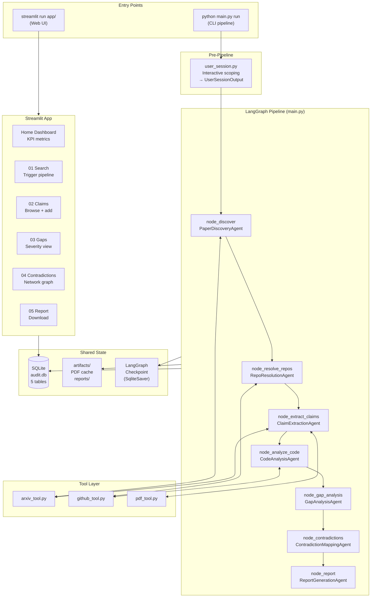
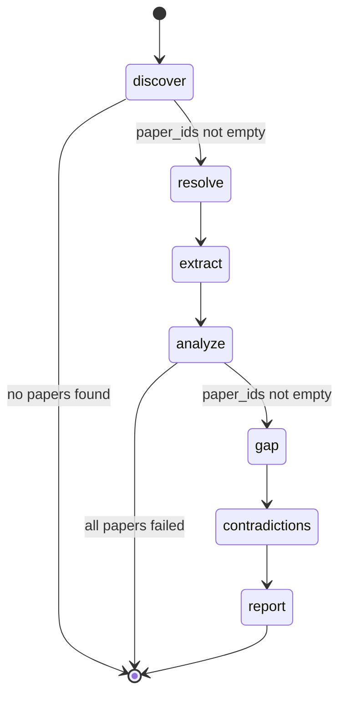
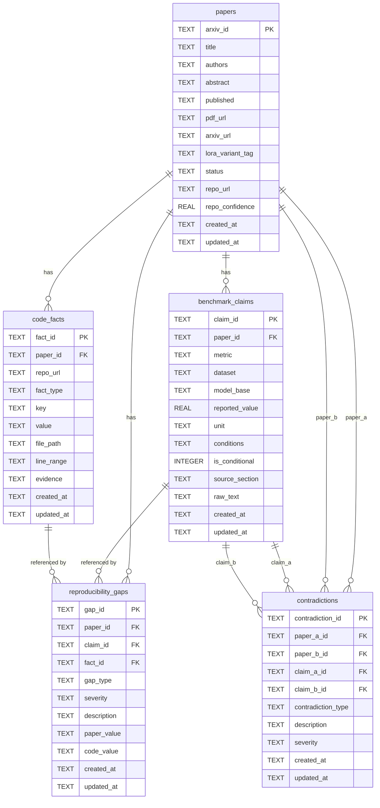
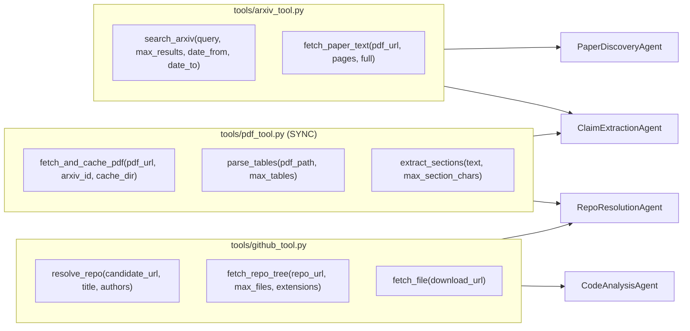
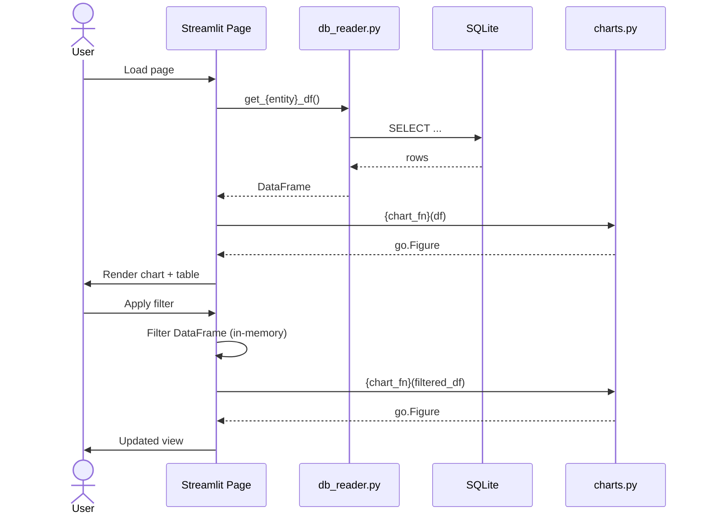
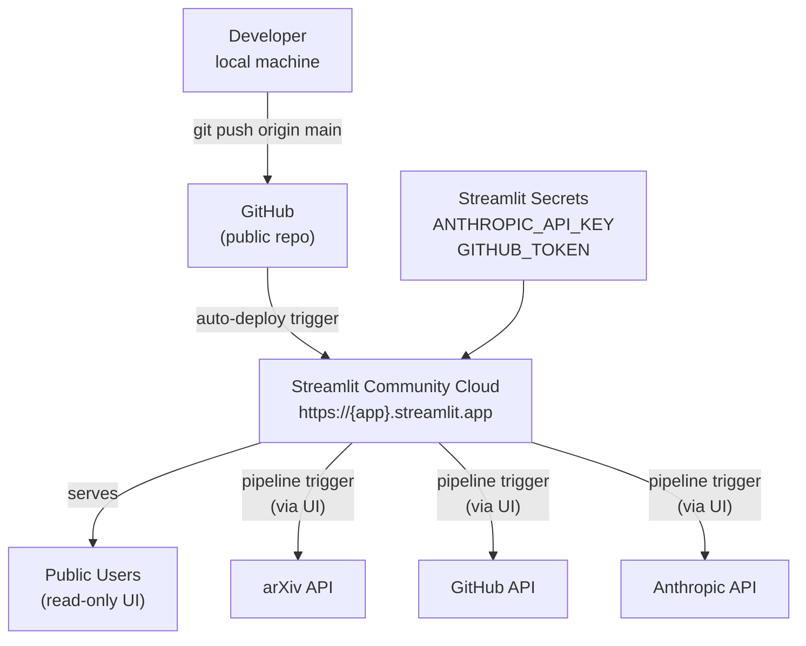
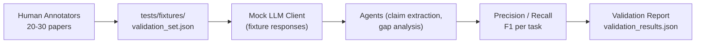
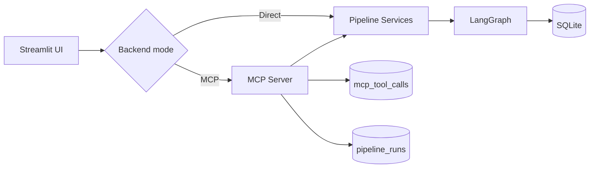
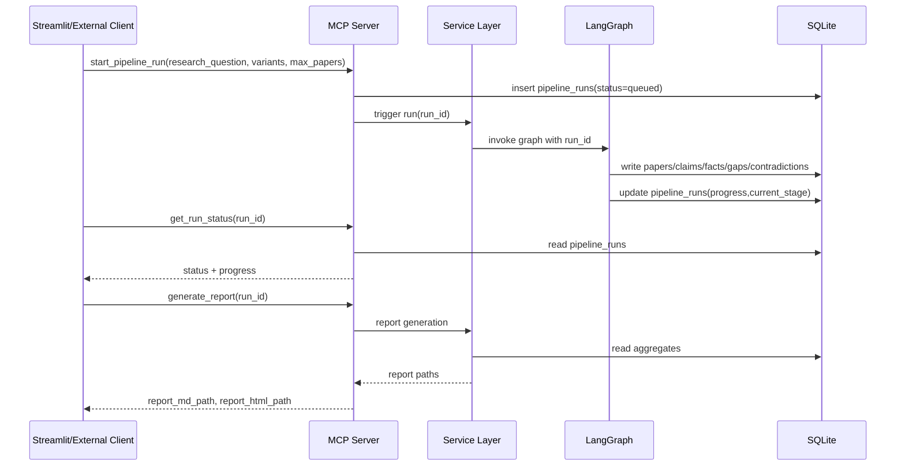

# design.md — ClaimCheck Technical Design

> Derived from `spec.md`. This document is the canonical reference for system design, data flow, component interfaces, and deployment architecture. Update this document whenever `spec.md` changes significantly.

---

## 1. System Overview

ClaimCheck is a **7-agent agentic pipeline** that autonomously:
1. Discovers LoRA-variant ML papers from arXiv
2. Resolves their GitHub repositories
3. Extracts structured benchmark claims from PDFs
4. Audits implementation code for reproducibility
5. Maps contradictions across the paper corpus
6. Generates a structured audit report
7. Exposes all findings through an interactive Streamlit web application



---

## 2. Component Design

### 2.1 LangGraph Graph

The pipeline is a **directed acyclic graph** with conditional edges. LangGraph handles:
- **State persistence**: `GraphState` (TypedDict) is checkpointed after every node via `SqliteSaver`
- **Resume capability**: `--resume` flag replays from the last completed node
- **Conditional routing**: Papers with no repo skip code analysis; empty corpora skip report



**GraphState fields:**

| Field | Type | Set by |
|---|---|---|
| `query_terms` | `list[str]` | user_session |
| `variants_of_interest` | `list[str] \| str` | user_session |
| `benchmarks_of_interest` | `list[str] \| str` | user_session |
| `research_question` | `str` | user_session |
| `paper_ids` | `list[str]` | node_discover |
| `current_paper_id` | `str \| None` | per-paper loops |
| `papers_processed` | `int` | incremented per node |
| `errors` | `list[str]` | any failing node |
| `report_path` | `str \| None` | node_report |

---

### 2.2 Agent Interfaces

Each agent exposes:
- `run(input: InputModel) -> OutputModel` — single-paper operation
- `run_all(paper_ids: list[str]) -> None` — batch operation called from LangGraph nodes

All agents use the shared concurrency semaphore (`PIPELINE_CONCURRENCY=3`) from `base_agent.py`.

```mermaid
classDiagram
    class BaseAgentUtils {
        +run_with_limit(coro) Any
        +with_retry(max_attempts, backoff_base) decorator
        +get_logger(name) BoundLogger
    }

    class PaperDiscoveryAgent {
        +run(input: PaperDiscoveryInput) PaperDiscoveryOutput
        +run_all(query_terms) None
    }

    class RepoResolutionAgent {
        +run(input: RepoResolutionInput) RepoResolutionOutput
        +run_all(paper_ids) None
    }

    class ClaimExtractionAgent {
        +run(input: ClaimExtractionInput) ClaimExtractionOutput
        +run_all(paper_ids) None
    }

    class CodeAnalysisAgent {
        +run(input: CodeAnalysisInput) CodeAnalysisOutput
        +run_all(paper_ids) None
    }

    class GapAnalysisAgent {
        +run(input: GapAnalysisInput) GapAnalysisOutput
        +run_all(paper_ids) None
    }

    class ContradictionMappingAgent {
        +run() ContradictionMappingOutput
    }

    class ReportGenerationAgent {
        +run(input: ReportGenerationInput) ReportGenerationOutput
    }

    BaseAgentUtils <.. PaperDiscoveryAgent
    BaseAgentUtils <.. RepoResolutionAgent
    BaseAgentUtils <.. ClaimExtractionAgent
    BaseAgentUtils <.. CodeAnalysisAgent
    BaseAgentUtils <.. GapAnalysisAgent
    BaseAgentUtils <.. ContradictionMappingAgent
    BaseAgentUtils <.. ReportGenerationAgent
```



---

### 2.3 Data Model Relationships



---

### 2.4 Tool Layer



**Critical**: `pdf_tool.py` is synchronous. Agents call it via:
```python
loop = asyncio.get_event_loop()
text = await loop.run_in_executor(None, fetch_and_cache_pdf, pdf_url, arxiv_id, cache_dir)
```

---

## 3. Streamlit Frontend Design

### 3.1 Page Architecture

```
app/
├── streamlit_app.py          ← Home: KPI metrics dashboard
└── pages/
    ├── 01_Search.py          ← Trigger pipeline, monitor progress
    ├── 02_Claims.py          ← Filter/browse claims + manual claim input
    ├── 03_Gaps.py            ← Reproducibility gap analysis
    ├── 04_Contradictions.py  ← Cross-paper contradiction network graph
    └── 05_Report.py          ← Download audit report (MD/HTML)
```

### 3.2 Data Flow in UI



### 3.3 Chart Inventory

| Page | Chart | Type | Axes |
|---|---|---|---|
| Home | Pipeline status | Bar (horizontal) | Status → Count |
| Claims | Claims by metric | Bar | Metric → Count |
| Claims | Metric × Dataset density | Heatmap | Dataset × Metric |
| Claims | Reported values distribution | Box plot | Metric → Value |
| Gaps | Severity distribution | Donut | Severity → % |
| Gaps | Gaps per paper | Stacked bar (horizontal) | Paper → Gap count |
| Gaps | Gap type breakdown | Treemap | Type hierarchy |
| Contradictions | Contradiction network | Force-directed graph | Papers (nodes) + Contradictions (edges) |
| Contradictions | Contradictions by metric | Bar | Metric → Count |
| Report | Summary statistics | Table | — |

### 3.4 Manual Claim Input

The `02_Claims.py` page exposes a form that writes directly to `benchmark_claims` via `db/queries.py`. This supports the **validation annotation workflow**: annotators can add ground-truth claims for the 20–30 paper validation set without running the full pipeline.

Fields: `paper_id`, `metric`, `dataset`, `model_base`, `reported_value`, `unit`, `conditions` (JSON), `is_conditional`, `source_section`, `raw_text`.

---

## 4. Claim Graph (NetworkX)

`ContradictionMappingAgent` builds a directed claim graph before sending clusters to the LLM.

```python
G = nx.DiGraph()

# Nodes: one per BenchmarkClaim
G.add_node(claim_id, paper_id=..., metric=..., dataset=..., model_base=..., value=...)

# Edges: contradiction relationship
G.add_edge(claim_a_id, claim_b_id,
           contradiction_type=..., severity=..., description=...)
```

**Clustering strategy** (Python, no LLM):
1. Group all claims by `(metric, dataset, model_base)` using `pandas.groupby`
2. Discard clusters with all claims from the same paper
3. For each cluster: if ≤ 20 claims → send to LLM as one batch
4. If > 20 claims → select the claim from the most-cited paper as pivot; send pairwise

The graph is serialised to `artifacts/claim_graph.json` (NetworkX JSON format) for the report and the Streamlit contradiction network chart.

---

## 5. LLM Prompt Strategy

All agents use **Claude Sonnet 4.6** with:
- `temperature=0.1` — low for structured extraction
- `max_tokens=8192` — sufficient for full paper sections
- JSON-only output enforced via prompt + retry

### Token budget management

| Agent | Context size strategy |
|---|---|
| PaperDiscovery | Abstract only (≤ 2000 tokens) |
| RepoResolution | First 2 PDF pages (≤ 4000 tokens) |
| ClaimExtraction | Full paper; 30-page sliding windows if > 100 pages |
| CodeAnalysis | Per-file; 200-line chunks if > 500 lines |
| GapAnalysis | Structured JSON only (no raw text) |
| ContradictionMapping | Per-cluster (≤ 20 claims) |
| ReportGeneration | Aggregated stats + top-N items |

---

## 6. Error Handling & Resilience

```mermaid
flowchart TD
    START["Agent.run(paper_id)"]
    TRY["Try: execute agent logic"]
    LLM_FAIL{"LLM JSON\nmalformed?"}
    RETRY["Retry with\n'JSON only' prefix"]
    LLM_FAIL2{"Still malformed?"}
    MARK_FAIL["update_paper_status(FAILED)\nlog ERROR"]
    HTTP_429{"HTTP 429\nrate limit?"]
    BACKOFF["Exponential backoff\n(max 5 retries)"]
    HTTP_404{"GitHub repo\n404?"]
    STRIP["Strip path segments\nTry parent URL"]
    NULL_REPO["repo_url = NULL\nlog WARNING"]
    SUCCESS["Return OutputModel\nupdate_paper_status(NEXT)"]

    START --> TRY
    TRY --> LLM_FAIL
    LLM_FAIL -- Yes --> RETRY --> LLM_FAIL2
    LLM_FAIL2 -- Yes --> MARK_FAIL
    LLM_FAIL2 -- No --> SUCCESS
    LLM_FAIL -- No --> HTTP_429
    HTTP_429 -- Yes --> BACKOFF --> TRY
    HTTP_429 -- No --> HTTP_404
    HTTP_404 -- Yes --> STRIP --> NULL_REPO
    HTTP_404 -- No --> SUCCESS
```

**Pipeline resilience**: A failed paper does not stop other papers. `PIPELINE_CONCURRENCY=3` means at most 3 papers are in-flight simultaneously. Papers that fail can be retried by rerunning with `--resume` after fixing the underlying issue.

---

## 7. Deployment Architecture



### Deployment Constraints

| Constraint | Handling |
|---|---|
| Streamlit Cloud has no persistent disk | SQLite `audit.db` and `artifacts/` are pre-populated and committed to the repo for the demo dataset |
| Streamlit Cloud memory limit (~1 GB) | PDF cache limited to 50 MB; large repos truncated at 200 files |
| Pipeline run takes 10–30 min | Progress shown via `st.progress` + `st.spinner`; long runs triggered via background job |
| No background processes on Streamlit Cloud free tier | Full pipeline run available in CLI mode locally; UI shows pre-computed demo results |

### Demo Dataset Strategy

For the public deployment, a pre-computed `data/audit.db` covering 20 papers is committed to the repo. The Streamlit UI shows these results immediately. Users can trigger new runs locally using the CLI.

---

## 8. Validation Architecture



**`validation_set.json` schema:**
```json
[
  {
    "arxiv_id": "2106.09685",
    "ground_truth_claims": [
      {"metric": "accuracy", "dataset": "GLUE/MNLI", "model_base": "RoBERTa-large",
       "reported_value": 90.2, "conditions": {"rank": "8"}, "is_conditional": true}
    ],
    "known_gaps": [
      {"gap_type": "condition_undisclosed", "severity": "major",
       "description": "Paper uses rank=8 but default config sets rank=16"}
    ],
    "known_contradictions": []
  }
]
```

---

## 9. Security Considerations

| Risk | Mitigation |
|---|---|
| API key exposure | Keys in `.env` (gitignored) + Streamlit Secrets UI; never hardcoded |
| Prompt injection in paper text | LLM called with structured JSON schema; output validated by Pydantic before use |
| Path traversal in PDF cache | `arxiv_id` sanitized (only alphanumeric + `.` allowed) before use as filename |
| SQLite injection | Parameterized queries only; no string formatting of SQL |
| GitHub token scope | Read-only `read:public_repo` scope; no write access |
| Large repo fetch | Max 200 files, max 500 KB per file; hard limits in `github_tool.py` |

---

## 9. Academic Evaluation Protocol

### Research Questions Mapping to System Components

| RQ | Question | System component that produces evidence |
|---|---|---|
| RQ1 | What fraction of claims are reproducible? | `GapAnalysisAgent` → `reproducibility_gaps` table; `gaps_by_severity` stats |
| RQ2 | How often do cross-paper comparisons contradict? | `ContradictionMappingAgent` → `contradictions` table; `contradictions_by_severity` |
| RQ3 | How accurately does the system extract claims vs. human annotation? | `tests/test_validation_set.py` → precision/recall/F1 against `validation_set.json` |

### Evaluation Report Format

The `tests/test_validation_set.py` produces `validation_results.json`:

```json
{
  "claim_extraction": {
    "precision": 0.87,
    "recall": 0.82,
    "f1": 0.84,
    "papers_evaluated": 25,
    "total_ground_truth_claims": 312,
    "total_extracted_claims": 298
  },
  "gap_detection": {
    "precision": 0.79,
    "recall": 0.76,
    "f1": 0.77,
    "papers_evaluated": 20
  },
  "contradiction_detection": {
    "precision": 0.71,
    "recall": 0.68,
    "f1": 0.69,
    "clusters_evaluated": 45
  },
  "corpus_statistics": {
    "total_papers": 30,
    "papers_with_code": 22,
    "papers_without_code": 8,
    "total_claims": 487,
    "conditional_claims_pct": 0.34,
    "critical_gaps_pct": 0.28,
    "papers_with_contradiction": 0.41
  }
}
```

### Reporting Findings as a Contribution

The final report (`reports/audit_report.md`) is structured to be submitted as an empirical study:
- **Abstract** (LLM-generated executive summary)
- **Finding 1**: % of claims reproducible by severity (answers RQ1)
- **Finding 2**: Cross-paper contradiction rate, top conflicts (answers RQ2)
- **Finding 3**: System accuracy metrics from validation set (answers RQ3)
- **Conclusion**: Implications for the LoRA research community

---

## 10. Extension Points (v2+)

| Feature | Design note |
|---|---|
| Semantic Scholar search | Add `tools/semantic_scholar_tool.py`; extend `PaperDiscoveryAgent` with additional source |
| Non-LoRA PEFT methods | Add `peft_family` field to `papers` table; parameterize agent prompts |
| Experiment re-execution | New agent `ExperimentAgent` that clones repo and runs training with detected config |
| Real-time pipeline progress | Use `st.empty()` + LangGraph streaming callbacks to push node completion events to UI |
| Multi-user Streamlit | Replace SQLite with PostgreSQL; add user_id column to all tables |
| arXiv alerting | Scheduled cron job runs `paper_discovery` weekly; new papers auto-queued |
| Export to CSV/JSON | Add download buttons to all Streamlit pages via `st.download_button` |

---

## 11. MCP Deployment Architecture

MCP is introduced as an interoperability layer. Core pipeline logic remains in LangGraph/services.



### MCP server components

| Component | Responsibility |
|---|---|
| `mcp_server/server.py` | server bootstrap and tool registration |
| `mcp_server/schemas.py` | strict request/response validation |
| `mcp_server/tools/*.py` | thin handlers mapping tools to service calls |
| `mcp_server/auth.py` | token auth and rate limiting |
| `mcp_server/run_manager.py` | run lifecycle and progress updates |

### End-to-end MCP sequence



### MCP operational requirements

| Area | Requirement |
|---|---|
| Availability | MCP server should degrade gracefully to direct mode in Streamlit |
| Security | Token auth for mutating tools + per-tool rate limiting |
| Observability | Persist every tool call with latency in `mcp_tool_calls` |
| Traceability | All outputs linked to `run_id` in `pipeline_runs` |
| Compatibility | Same service layer used in direct mode and MCP mode |

### Public deployment topology

For public hosting, deploy two services:

1. Streamlit UI (public frontend)
2. MCP server (private/internal endpoint)

The UI should not expose MCP auth tokens to browsers. All sensitive credentials remain server-side.
