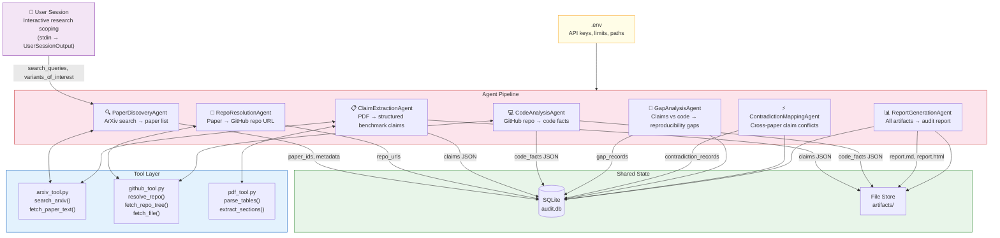

# SPEC.md — LoRA Variants Research Audit System

## Project Overview

An agentic pipeline that autonomously discovers LoRA-variant ML papers from arXiv, resolves their associated GitHub repositories, extracts and structures benchmark claims, audits the implementation code for reproducibility, maps contradictions and conditional claims across the paper corpus, and generates a structured audit report.

The system is built as a chain of seven specialized LLM agents, each with a discrete responsibility. Agents communicate through a shared SQLite database and a file-based artifact store. No agent blocks another; each reads from the store left by the upstream agent and writes its output before handing off.

**Goals:**
- Surface reproducibility gaps between paper-stated numbers and actual code
- Detect contradiction claims across papers that cite each other
- Flag conditional claims (e.g., "on dataset X with learning rate Y") that are routinely omitted from abstract-level comparisons
- Produce a human-readable and machine-readable audit report

**Non-goals:**
- Running training or re-running experiments
- Autonomous GitHub PR creation or paper rebuttals
- Coverage of non-LoRA parameter-efficient fine-tuning methods (in v1)

---

## Research Questions & Hypotheses

This project is driven by three empirically testable research questions:

| # | Research Question | Hypothesis |
|---|---|---|
| RQ1 | What fraction of benchmark claims in LoRA-variant papers can be reproduced from the released code? | H1: < 60% of critical benchmark claims are directly reproducible (hyperparameters, datasets, and evaluation code all present and matching) |
| RQ2 | How frequently do cross-paper benchmark comparisons contradict each other on the same metric/dataset/base-model triple? | H2: ≥ 30% of same-setup comparisons across papers will show a direct numeric contradiction (>2% relative difference) |
| RQ3 | How accurately can LLM agents extract structured benchmark claims from ML paper PDFs, compared to human annotation? | H3: Claim extraction will achieve ≥ 0.80 F1 against human-annotated ground truth on a 25-paper validation set |

These hypotheses are validated against the **hand-annotated validation set** (20–30 papers) described in the Validation Plan section. The empirical findings are the primary academic contribution.

---

## Novel Academic Contribution

ClaimCheck makes three novel contributions:

1. **A formal, reproducible methodology** for automated reproducibility auditing of PEFT literature — the first system to go beyond manual checking or paper summarization
2. **An empirical dataset**: a structured corpus of ~500+ benchmark claims with reproducibility labels and cross-paper contradiction tags across 20+ LoRA-variant papers — publishable as a standalone dataset contribution
3. **A conditional claim schema** (`BenchmarkClaim.conditions` dict) that captures the hyperparameter context under which each claim is made — enabling comparison of "beats LoRA by 3%" claims that are only valid under specific rank/lr/dataset combinations

**Differentiator from existing tools:**

| Tool | Summarises Papers | Checks vs Code | Cross-paper Contradictions | Conditional Claims |
|---|---|---|---|---|
| Elicit / Consensus | ✓ | ✗ | ✗ | ✗ |
| Papers With Code | Partial (manual) | ✗ | ✗ | ✗ |
| Semantic Scholar | ✓ | ✗ | ✗ | ✗ |
| ML Reproducibility Challenge | Manual | Manual | ✗ | ✗ |
| **ClaimCheck (this work)** | ✓ | ✓ (automated) | ✓ (automated) | ✓ (structured) |

---

## Motivation — Real-World Pain Point

Published PEFT papers (LoRA, QLoRA, DoRA, AdaLoRA, LoRA+, VeRA, …) make numerous claims about improvements over baseline LoRA, typically on shared benchmarks (GLUE, commonsense reasoning suites, instruction-tuning evals). In practice:

- **Claims are not independently verifiable against the accompanying code** — hyperparameters differ, configs are incomplete, or the released code does not match the described method.
- **Claims contradict each other** — Method B claims to beat LoRA by X%, Method C claims to beat both, yet B and C are rarely compared directly. When conditions (rank, dataset, model size) differ, "beats LoRA" does not mean the same thing across papers.
- **Research engineers have no systematic way to know which claims hold up, under what conditions, and where the literature actually disagrees** — they either trust the abstract or spend days manually digging through code and tables.

This pain is currently addressed (if at all) via slow, manual, ad-hoc investigation. Existing literature tools (Elicit, Consensus, SciSpace) summarize *what papers say*, not whether what they say is *true relative to their own code*, nor *how claims relate across papers* in a structured, conditional way.

**Publishable contribution shape:** the output is not just a tool, but an *empirical audit of a specific literature* (LoRA variants) — e.g., "X% of claims in this literature are reproducible from released code/configs; Y% of 'beats LoRA' claims hold only under specific rank/dataset conditions." This fits reproducibility-focused workshops and "science of science" / meta-research venues.

---

## Why an Agentic Architecture (and Not Just an Augmented LLM Call)

A single well-prompted LLM call with retrieval could superficially "do" parts of this. A multi-agent architecture is genuinely needed — not nice-to-have — for the following reasons:

1. **Heterogeneous, multi-step information gathering per paper.** For each paper the system must (a) find the paper, (b) find its code repo — which may require a separate search if not directly linked, (c) read the paper, (d) explore a repository's file structure to find the relevant files (not just the README), and (e) cross-reference specific numbers/configs between paper and code. Later steps depend on the outcomes of earlier ones (which files to inspect depends on what the method section describes). This is the core definition of an agentic task: the LLM decides what to look at next based on what it has found, rather than having everything handed to it in one context window.
2. **The agentic refinement loop in discovery is load-bearing, not decorative.** A single-pass search for "LoRA variants" returns a mix of relevant, tangential, and noise results. The discovery agent must evaluate its own results and decide whether to broaden, narrow, or pivot — a feedback loop a single LLM call cannot perform because it has no results to react to within one call.
3. **Separation of concerns improves reliability and debuggability.** Claim extraction (reading prose, numbers, conditions) and code analysis (reading file structures, configs, implementation details) are different skills with different failure modes. Combining them into one mega-prompt means a single failure mode contaminates everything. As separate nodes with structured intermediate outputs (the claim schema, the code-fact schema), each step's output can be validated, logged, and debugged independently — critical for output that must be trustworthy enough to publish.
4. **Cross-paper aggregation genuinely requires all per-paper outputs as input.** This is inherently multi-document reasoning over the structured outputs of many prior agent runs. It cannot happen "in the same breath" as any single paper's analysis, because the comparison needs normalized, structured data from each paper — not raw text from all papers dumped together.
5. **Context window and cost management.** Reading 20+ full papers and their repos in one context would be enormous and expensive, forcing the model to "remember" everything at once. Per-paper agents with structured outputs mean each step operates on manageable context, and the expensive "read everything" step never has to happen — only the structured summaries get aggregated.
6. **Iterative, conditional control flow.** The discovery loop (refine until enough papers found, capped at N attempts), the "no code available → skip code analysis, flag it" branch, and the aggregation step (which runs only once all per-paper analyses are done) are conditional and stateful — exactly what LangGraph's graph/state model is designed for, and what a single LLM call fundamentally cannot express.

In short: a single augmented LLM call can summarize a paper you hand it. It cannot go find the right paper, find its code, decide what part of the code is relevant to check, compare that against what 19 other papers claimed, and flag the specific conditions under which contradictory claims are each true. That requires a system that takes actions, observes results, and adapts — i.e., agents.

---

## Key Benefits

- **For research engineers:** a concrete, queryable map of "what's actually been shown about LoRA variants, under what conditions, and how reproducible it is" — replacing days of manual digging with a structured report.
- **For the research community:** an empirical reproducibility audit of an actively-used literature, surfacing systemic issues (e.g., "60% of 'beats LoRA' claims lack complete configs for reproduction") that individual papers/reviewers do not surface.
- **As a publishable contribution:** the combination of (a) a novel agentic methodology for automated reproducibility auditing and (b) concrete empirical findings about a specific, relevant literature fits the shape of accepted papers in reproducibility/meta-research venues and ML workshops.
- **As a reusable framework:** the claim-extraction schema, gap-analysis pattern, and contradiction-mapping approach generalize to other PEFT/method families beyond LoRA — a natural future-work extension.

---

## LoRA Variant Taxonomy (v1 Scope)

The following papers define the v1 corpus. `lora_variant_tag` values in the `papers` table must come from this controlled vocabulary:

| Tag | Paper | ArXiv ID | Year |
|---|---|---|---|
| `LoRA` | LoRA: Low-Rank Adaptation of Large Language Models | 2106.09685 | 2021 |
| `QLoRA` | QLoRA: Efficient Finetuning of Quantized LLMs | 2305.14314 | 2023 |
| `AdaLoRA` | AdaLoRA: Adaptive Budget Allocation for PEFT | 2303.10512 | 2023 |
| `DoRA` | DoRA: Weight-Decomposed Low-Rank Adaptation | 2402.09353 | 2024 |
| `LoRA+` | LoRA+: Efficient Low Rank Adaptation of LLMs | 2402.12354 | 2024 |
| `VeRA` | VeRA: Vector-based Random Matrix Adaptation | 2310.11454 | 2023 |
| `DyLoRA` | DyLoRA: Parameter-Efficient Tuning with Dynamic Ranks | 2210.07558 | 2022 |
| `LoftQ` | LoftQ: LoRA-Fine-Tuning-Aware Quantization | 2310.08659 | 2023 |
| `LoRA-FA` | LoRA-FA: Memory-Efficient LLM Fine-Tuning | 2308.03303 | 2023 |
| `GLoRA` | One-for-All: Generalized LoRA for Parameter-Efficient Fine-Tuning | 2306.07967 | 2023 |
| `rsLoRA` | A Rank Stabilization Scaling Factor for Fine-Tuning with LoRA | 2312.03732 | 2023 |
| `MoLoRA` | Mixture of LoRA Experts | 2402.11453 | 2024 |
| `FLoRA` | Flora: Low-Rank Adapters Are Secretly Gradient Compressors | 2402.03293 | 2024 |

Papers discovered dynamically that match this taxonomy are tagged by `PaperDiscoveryAgent`'s LLM call. Unknown variants are tagged `OTHER_LORA` and included but flagged for review.

---

## Non-Functional Requirements

| ID | Requirement | Target | Measurement |
|---|---|---|---|
| NFR-1 | **Pipeline throughput** | 30 papers complete in < 3 hours | Logged elapsed time per run |
| NFR-2 | **API cost per 30-paper run** | < $15 USD | Tracked via Anthropic usage dashboard |
| NFR-3 | **Claim extraction recall** | ≥ 0.80 on validation set | `tests/test_validation_set.py` |
| NFR-4 | **Gap detection F1** | ≥ 0.75 on validation set | `tests/test_validation_set.py` |
| NFR-5 | **Streamlit UI response time** | < 2 s for any page load (pre-computed data) | Browser network tab |
| NFR-6 | **Pipeline resume fidelity** | `--resume` restarts from exact last node | `test_pipeline_smoke.py` |
| NFR-7 | **No API key exposure** | `.env` and `data/` are gitignored | CI lint check |
| NFR-8 | **Coverage** | ≥ 85% of papers complete without `status=FAILED` | Run metrics log |

---

## Estimated API Cost Model

For a 30-paper run (used to size `PIPELINE_MAX_PAPERS` default):

| Agent | Tokens per paper | × 30 papers | Subtotal |
|---|---|---|---|
| PaperDiscovery | ~2,000 (abstract only) | 30 | 60K |
| RepoResolution | ~4,000 (2 PDF pages) | 30 | 120K |
| ClaimExtraction | ~30,000 (full PDF avg) | 30 | 900K |
| CodeAnalysis | ~20,000 (5–10 files) | 30 | 600K |
| GapAnalysis | ~8,000 (structured JSON) | 30 | 240K |
| ContradictionMapping | ~2,000 × ~50 clusters | — | 100K |
| ReportGeneration | ~4,000 (stats + top-N) | 1 | 4K |
| **Total** | | | **~2.0M tokens** |

At Claude Sonnet 4.6 pricing (~$3/M input, ~$15/M output, ~80/20 split):
- Estimated cost: **$7–12 per 30-paper run**
- Set `PIPELINE_MAX_PAPERS=30` as the cost-safe default; power users can increase

Caching mitigation: PDF text is cached to `artifacts/pdfs/` — re-runs do not re-download or re-process PDFs (saving ~50% of ClaimExtraction and CodeAnalysis token cost on reruns).

---

## Limitations

1. **Static analysis only**: The system reads code but does not execute it. A paper with correct configs that runs successfully cannot be distinguished from one with correct configs that fails silently.
2. **PDF parsing quality**: `pdfplumber` fails on papers with multi-column layouts, rotated tables, or scanned images. Approximately 10–15% of arXiv PDFs require the `pymupdf` fallback; some may still produce low-quality text.
3. **LLM accuracy ceiling**: Claim extraction F1 is bounded by LLM understanding of table structure and notation. Unusual units or non-standard metric names (e.g., "GSM8K pass@1") may be miscategorised.
4. **Code availability**: ~20–30% of LoRA papers do not release code or release incomplete code. These papers receive `status=FAILED` at `code_analyzed` stage — they are counted in coverage metrics but contribute no code facts.
5. **Contradiction definition subjectivity**: The 2% relative difference threshold for `direct_numeric` contradiction is configurable but ultimately a design choice. Different thresholds produce different findings.
6. **Scope**: v1 covers LoRA-family methods only. GPT-style prefix tuning, adapter layers, or prompt tuning are not in scope.

---

## Ethical Considerations

- **Fair representation**: Gap reports describe discrepancies in code/paper alignment, not author intent. The system does not use language implying fraud or misconduct.
- **Naming**: Per-paper gap reports identify the paper (title + arXiv ID) but do not name individual authors in negative contexts.
- **Uncertainty disclosure**: All LLM-generated gap/contradiction findings are labelled as "automated analysis" and should be treated as hypotheses for human verification, not definitive conclusions.
- **Reproducibility of ClaimCheck itself**: The validation set, prompt templates, and evaluation scripts are committed to the repository so ClaimCheck's own methodology can be audited.
- **Data use**: Only publicly available papers from arXiv and public GitHub repos are accessed. No private repositories, paywalled content, or personal data are processed.

---

## Tech Stack

| Layer | Choice | Reason |
|---|---|---|
| Language | Python 3.11 | Async support, rich ML ecosystem |
| LLM SDK | `anthropic` (claude-sonnet-4-6) | Tool use, structured output, long context for full PDFs |
| Agent orchestration | **LangGraph** (stateful graph) | Checkpointed state, conditional edges, agentic loops, built-in retry |
| ArXiv access | `arxiv` PyPI package + direct PDF fetch | Metadata + full text |
| GitHub access | `PyGithub` + `httpx` for raw file fetch | Repo tree traversal and file retrieval |
| PDF parsing | `pdfplumber` + `pymupdf` (fallback) | Table extraction for benchmark rows |
| Database | SQLite via `aiosqlite` | Lightweight, file-portable, no server |
| Claim graph | `networkx` | Cross-paper claim graph construction |
| Data analysis | `pandas` | Claim aggregation, deduplication, statistics |
| Validation | `pydantic` v2 | Schema enforcement at every agent boundary |
| Config | `pydantic-settings` + `.env` | Typed, validated secrets at startup |
| CLI | `typer` | Entrypoint commands |
| Frontend | `streamlit` | Interactive web UI, charts, claim input |
| Charts | `plotly` | Interactive reproducibility/contradiction graphs |
| Reporting | `jinja2` (HTML) + `markdown` (MD) | Dual-format output |
| Logging | `structlog` | JSON-structured logs per agent run |
| Testing | `pytest` + `pytest-asyncio` | Unit + integration |
| Interoperability | MCP (Model Context Protocol) server | Standardized tool interface for external clients |
| Deployment | Streamlit Community Cloud | Free public hosting, auto-deploy from GitHub |

---

## Project Mermaid Diagram



---

## Data Models

All models are defined in `models.py` using Pydantic v2. Each agent validates its input and output against these schemas.

```python
# models.py

from __future__ import annotations
from datetime import datetime
from enum import Enum
from typing import Optional
from pydantic import BaseModel, HttpUrl, field_validator


class PaperStatus(str, Enum):
    DISCOVERED = "discovered"
    REPO_RESOLVED = "repo_resolved"
    CLAIMS_EXTRACTED = "claims_extracted"
    CODE_ANALYZED = "code_analyzed"
    GAPS_ANALYZED = "gaps_analyzed"
    DONE = "done"
    FAILED = "failed"


class Paper(BaseModel):
    arxiv_id: str                          # e.g. "2106.09685"
    title: str
    authors: list[str]
    abstract: str
    published: datetime
    pdf_url: HttpUrl
    arxiv_url: HttpUrl
    lora_variant_tag: str                  # e.g. "LoRA", "QLoRA", "AdaLoRA"
    status: PaperStatus = PaperStatus.DISCOVERED
    repo_url: Optional[HttpUrl] = None
    repo_confidence: Optional[float] = None  # 0.0–1.0
    citation_count: Optional[int] = None     # from arXiv/Semantic Scholar; used as contradiction pivot weight


class BenchmarkClaim(BaseModel):
    paper_id: str                           # FK → Paper.arxiv_id
    claim_id: str                           # UUID
    metric: str                             # e.g. "BLEU", "accuracy", "perplexity"
    dataset: str                            # e.g. "GLUE/MNLI", "WinoGrande"
    model_base: str                         # e.g. "LLaMA-7B"
    reported_value: float
    unit: Optional[str] = None              # e.g. "%", "points"
    conditions: dict[str, str] = {}        # e.g. {"rank": "8", "lr": "3e-4"}
    is_conditional: bool = False
    claim_confidence: float = 1.0           # LLM self-assessed extraction confidence 0.0–1.0; filtered by CLAIM_MIN_CONFIDENCE
    source_section: str                     # e.g. "Table 2", "Section 4.1"
    raw_text: str                           # verbatim sentence from paper


class CodeFact(BaseModel):
    paper_id: str
    repo_url: str
    fact_id: str                            # UUID
    fact_type: str                          # "hyperparameter", "dataset", "metric_logged", "missing_eval"
    key: str                                # e.g. "rank", "learning_rate"
    value: Optional[str] = None
    file_path: str
    line_range: Optional[tuple[int, int]] = None
    evidence: str                           # code snippet or comment


class ReproducibilityGap(BaseModel):
    gap_id: str                             # UUID
    paper_id: str
    claim_id: str                           # FK → BenchmarkClaim.claim_id
    fact_id: Optional[str] = None          # FK → CodeFact.fact_id
    gap_type: str                           # "missing_code", "value_mismatch", "dataset_mismatch",
                                            # "condition_undisclosed", "metric_not_implemented"
    severity: str                           # "critical", "major", "minor"
    description: str
    paper_value: Optional[str] = None
    code_value: Optional[str] = None


class Contradiction(BaseModel):
    contradiction_id: str                   # UUID
    paper_a_id: str
    paper_b_id: str
    claim_a_id: str
    claim_b_id: str
    contradiction_type: str                 # "direct_numeric", "conditional_flip", "dataset_scope"
    description: str
    severity: str                           # "high", "medium", "low"


class AuditReport(BaseModel):
    generated_at: datetime
    papers_audited: int
    total_claims: int
    total_gaps: int
    total_contradictions: int
    critical_gaps: list[ReproducibilityGap]
    high_contradictions: list[Contradiction]
    summary_by_paper: list[dict]
    methodology_notes: str


class UserSessionOutput(BaseModel):
    research_question: str           # one-sentence distillation of user's goal
    variants_of_interest: list[str] | str   # specific variants or "all"
    benchmarks_of_interest: list[str] | str # specific benchmarks or "all"
    search_queries: list[str]        # 3-5 arXiv query strings → feeds PaperDiscoveryInput.query_terms
    raw_user_input: str              # original verbatim input (+ follow-up if any)
    ambiguous: bool = False          # True if WARNING "ambiguous_user_query" was logged
```

**SQLite schema** (`db/schema.sql`) mirrors these models with `papers`, `benchmark_claims`, `code_facts`, `reproducibility_gaps`, `contradictions` tables. All tables include `created_at` and `updated_at` timestamps.

---

## Database Queries — `db/queries.py`

All database writes and reads go through this module. No agent constructs SQL directly. Every function is `async` and manages its own `aiosqlite` connection. `PRAGMA journal_mode=WAL` is set on every connection to allow concurrent readers.

**Serialisation conventions** (Python → SQLite):

| Python type | SQL storage | Notes |
|---|---|---|
| `list[str]` | TEXT | `json.dumps` / `json.loads` |
| `dict[str, str]` | TEXT | `json.dumps` / `json.loads` |
| `tuple[int, int]` | TEXT | `"start,end"` or `NULL` |
| `HttpUrl` | TEXT | `str(value)` |
| `datetime` | TEXT | ISO-8601 UTC (`datetime.isoformat()`) |
| `Enum` | TEXT | `.value` |
| `bool` | INTEGER | `1` / `0` |
| `Optional[X]` | nullable column | `None` → `NULL` |

`created_at` and `updated_at` are set by queries.py, not by the caller. `updated_at` is refreshed on every `UPDATE`.

```python
# db/queries.py

from __future__ import annotations
import json
from datetime import datetime, timezone

import aiosqlite

from config import settings
from models import (
    BenchmarkClaim,
    CodeFact,
    Contradiction,
    Paper,
    PaperStatus,
    ReproducibilityGap,
)


async def _connect() -> aiosqlite.Connection:
    conn = await aiosqlite.connect(settings.db_path)
    conn.row_factory = aiosqlite.Row
    await conn.execute("PRAGMA journal_mode=WAL")
    return conn


def _now() -> str:
    return datetime.now(timezone.utc).isoformat()


# ── Papers ────────────────────────────────────────────────────────────────────

async def insert_paper(paper: Paper) -> None:
    """
    INSERT OR IGNORE into `papers`.
    Duplicate arxiv_id is silently skipped — status advances only through
    update_paper_status(), never by re-inserting.

    SQL:
        INSERT OR IGNORE INTO papers
            (arxiv_id, title, authors, abstract, published, pdf_url, arxiv_url,
             lora_variant_tag, status, repo_url, repo_confidence, created_at, updated_at)
        VALUES (?, ?, ?, ?, ?, ?, ?, ?, ?, ?, ?, ?, ?)
    """

async def update_paper_status(arxiv_id: str, status: PaperStatus) -> None:
    """
    Advance the pipeline status of a paper and refresh updated_at.

    SQL:
        UPDATE papers SET status = ?, updated_at = ? WHERE arxiv_id = ?
    """

async def get_papers_by_status(status: PaperStatus) -> list[Paper]:
    """
    Fetch all papers in a given pipeline state.
    Rows are reconstructed via Paper.model_validate(dict(row)) after
    JSON-decoding `authors` and parsing `published` back to datetime.

    SQL:
        SELECT * FROM papers WHERE status = ?
    """


# ── Benchmark Claims ──────────────────────────────────────────────────────────

async def insert_claim(claim: BenchmarkClaim) -> None:
    """
    INSERT OR IGNORE into `benchmark_claims`.
    Primary key is claim_id (UUID) — duplicate UUIDs are a bug, not an
    expected case; the IGNORE guard is purely defensive.

    SQL:
        INSERT OR IGNORE INTO benchmark_claims
            (claim_id, paper_id, metric, dataset, model_base, reported_value,
             unit, conditions, is_conditional, source_section, raw_text,
             created_at, updated_at)
        VALUES (?, ?, ?, ?, ?, ?, ?, ?, ?, ?, ?, ?, ?)
    """

async def get_claims_by_paper(paper_id: str) -> list[BenchmarkClaim]:
    """
    Fetch all claims for one paper.
    `conditions` JSON is decoded; `is_conditional` INTEGER is cast to bool.

    SQL:
        SELECT * FROM benchmark_claims WHERE paper_id = ?
    """

async def get_all_claims() -> list[BenchmarkClaim]:
    """
    Full claim corpus ordered by (paper_id, claim_id).
    Used by ContradictionMappingAgent to load all claims for clustering.

    SQL:
        SELECT * FROM benchmark_claims ORDER BY paper_id, claim_id
    """


# ── Code Facts ────────────────────────────────────────────────────────────────

async def insert_code_fact(fact: CodeFact) -> None:
    """
    INSERT OR IGNORE into `code_facts`.
    `line_range` tuple is serialised as "start,end" TEXT or NULL.

    SQL:
        INSERT OR IGNORE INTO code_facts
            (fact_id, paper_id, repo_url, fact_type, key, value,
             file_path, line_range, evidence, created_at, updated_at)
        VALUES (?, ?, ?, ?, ?, ?, ?, ?, ?, ?, ?)
    """

async def get_facts_by_paper(paper_id: str) -> list[CodeFact]:
    """
    Fetch all code facts for one paper.
    `line_range` is parsed from "start,end" back to tuple[int, int] or None.

    SQL:
        SELECT * FROM code_facts WHERE paper_id = ?
    """


# ── Reproducibility Gaps ──────────────────────────────────────────────────────

async def insert_gap(gap: ReproducibilityGap) -> None:
    """
    INSERT OR IGNORE into `reproducibility_gaps`.

    SQL:
        INSERT OR IGNORE INTO reproducibility_gaps
            (gap_id, paper_id, claim_id, fact_id, gap_type, severity,
             description, paper_value, code_value, created_at, updated_at)
        VALUES (?, ?, ?, ?, ?, ?, ?, ?, ?, ?, ?)
    """


# ── Contradictions ────────────────────────────────────────────────────────────

async def insert_contradiction(c: Contradiction) -> None:
    """
    INSERT OR IGNORE into `contradictions`.

    SQL:
        INSERT OR IGNORE INTO contradictions
            (contradiction_id, paper_a_id, paper_b_id, claim_a_id, claim_b_id,
             contradiction_type, description, severity, created_at, updated_at)
        VALUES (?, ?, ?, ?, ?, ?, ?, ?, ?, ?)
    """


# ── Read helpers ────────────────────────────────────────────────────────────

async def get_all_papers() -> list[Paper]:
    """
    Fetch all papers regardless of status.
    Used by ContradictionMappingAgent (needs full Paper list for citation pivot)
    and ReportGenerationAgent.

    SQL:
        SELECT * FROM papers ORDER BY published DESC
    """

async def get_gaps_by_paper(paper_id: str) -> list[ReproducibilityGap]:
    """
    Fetch all reproducibility gaps for one paper.
    Used by ReportGenerationAgent to build per-paper sections.

    SQL:
        SELECT * FROM reproducibility_gaps WHERE paper_id = ?
    """

async def get_all_gaps() -> list[ReproducibilityGap]:
    """
    Full gap corpus ordered by (severity, paper_id).
    Used by ReportGenerationAgent for top-N critical gaps.

    SQL:
        SELECT * FROM reproducibility_gaps ORDER BY
            CASE severity WHEN 'critical' THEN 0 WHEN 'major' THEN 1 ELSE 2 END,
            paper_id
    """

async def get_all_contradictions() -> list[Contradiction]:
    """
    Full contradiction corpus ordered by (severity, contradiction_id).
    Used by ReportGenerationAgent and ContradictionMappingAgent for de-duplication.

    SQL:
        SELECT * FROM contradictions ORDER BY
            CASE severity WHEN 'high' THEN 0 WHEN 'medium' THEN 1 ELSE 2 END,
            contradiction_id
    """


# ── Aggregates ────────────────────────────────────────────────────────────────

async def get_audit_stats() -> dict:
    """
    Return a single dict of aggregated counts for the report generator.
    Runs all COUNT queries in one connection; does NOT load full rows.

    Return shape:
    {
        "papers_total": int,
        "papers_by_status": {PaperStatus.value: int, ...},   # all 7 statuses
        "claims_total": int,
        "claims_conditional": int,
        "code_facts_total": int,
        "gaps_total": int,
        "gaps_by_severity": {"critical": int, "major": int, "minor": int},
        "contradictions_total": int,
        "contradictions_by_severity": {"high": int, "medium": int, "low": int},
    }
    """
```

---

## Database Initialisation — `db/init_db.py`

```python
# db/init_db.py

from __future__ import annotations
import asyncio
from pathlib import Path

import aiosqlite

from config import settings

SCHEMA_PATH = Path(__file__).parent / "schema.sql"


async def create_tables(db_path: Path | None = None) -> None:
    """
    Initialise the database by executing schema.sql.
    Idempotent: CREATE TABLE IF NOT EXISTS means safe to re-run.
    Called by main.py before the pipeline starts.
    """
    path = db_path or settings.db_path
    path.parent.mkdir(parents=True, exist_ok=True)
    sql = SCHEMA_PATH.read_text(encoding="utf-8")
    async with aiosqlite.connect(str(path)) as conn:
        await conn.executescript(sql)
        await conn.commit()


if __name__ == "__main__":
    asyncio.run(create_tables())
    print(f"Database initialised at {settings.db_path}")
```

**Usage:**
```bash
python db/init_db.py          # creates data/audit.db from schema.sql
python db/init_db.py          # safe to re-run (idempotent)
```

---

## Base Agent — `agents/base_agent.py`

Every agent module imports exactly three names from this file:

```python
from agents.base_agent import run_with_limit, with_retry, get_logger
```

There is no base class and no abstract interface — this module is a utilities file, not a framework.

```python
# agents/base_agent.py

from __future__ import annotations
import asyncio
import functools
import logging
import random
import sys
from collections.abc import Callable, Coroutine
from typing import Any, TypeVar

import structlog

from config import settings

_F = TypeVar("_F", bound=Callable[..., Coroutine[Any, Any, Any]])

_semaphore: asyncio.Semaphore | None = None


def _get_semaphore() -> asyncio.Semaphore:
    global _semaphore
    if _semaphore is None:
        _semaphore = asyncio.Semaphore(settings.pipeline_concurrency)
    return _semaphore


async def run_with_limit(coro: Coroutine[Any, Any, Any]) -> Any:
    """
    Await *coro* inside the shared pipeline semaphore.
    Cap is PIPELINE_CONCURRENCY from .env (default 3).
    The semaphore is created lazily on first call and is module-global,
    so all agents share the same limit within one event loop.

    Usage:
        result = await run_with_limit(agent.run(input_model))
    """
    async with _get_semaphore():
        return await coro


def with_retry(
    max_attempts: int = 3,
    backoff_base: float = 2.0,
    jitter_max: float = 1.0,
    retriable: tuple[type[Exception], ...] = (Exception,),
) -> Callable[[_F], _F]:
    """
    Async function decorator — retries up to *max_attempts* times on any
    exception in *retriable*.

    Back-off formula:  sleep = backoff_base ** attempt + uniform(0, jitter_max)
    attempt 0 → no sleep (raises or returns immediately)
    attempt 1 → sleep ~2 s
    attempt 2 → sleep ~4 s

    On every retry a structured WARNING is logged via get_logger.
    Raises the last exception when all attempts are exhausted.

    Usage:
        @with_retry(max_attempts=5, backoff_base=2.0, retriable=(httpx.HTTPError,))
        async def fetch_pdf(url: str) -> str: ...
    """
    def decorator(fn: _F) -> _F:
        @functools.wraps(fn)
        async def wrapper(*args: Any, **kwargs: Any) -> Any:
            log = get_logger(fn.__module__)
            last_exc: Exception | None = None
            for attempt in range(max_attempts):
                try:
                    return await fn(*args, **kwargs)
                except retriable as exc:
                    last_exc = exc
                    if attempt < max_attempts - 1:
                        delay = backoff_base ** attempt + random.uniform(0, jitter_max)
                        log.warning(
                            "retry",
                            fn=fn.__qualname__,
                            attempt=attempt + 1,
                            max_attempts=max_attempts,
                            delay_s=round(delay, 2),
                            exc=str(exc),
                        )
                        await asyncio.sleep(delay)
            raise last_exc  # type: ignore[misc]
        return wrapper  # type: ignore[return-value]
    return decorator


def get_logger(name: str) -> structlog.stdlib.BoundLogger:
    """
    Return a structlog bound logger for *name*.
    All agents call this at module level:  log = get_logger(__name__)

    Output format:
    - LOG_LEVEL == DEBUG  →  ConsoleRenderer (colored, human-readable)
    - All other levels    →  JSONRenderer (one JSON object per log line)

    structlog.configure() is called exactly once at module import.
    Subsequent get_logger() calls are cache-hits (structlog's own cache).
    """
    return structlog.get_logger(name)


# ── One-time structlog configuration ─────────────────────────────────────────

def _configure_structlog() -> None:
    level_str = getattr(settings, "log_level", "INFO").upper()
    level = getattr(logging, level_str, logging.INFO)

    shared_processors: list[Any] = [
        structlog.stdlib.add_log_level,
        structlog.stdlib.add_logger_name,
        structlog.processors.TimeStamper(fmt="iso", utc=True),
        structlog.processors.StackInfoRenderer(),
        structlog.processors.format_exc_info,
    ]
    renderer: Any = (
        structlog.dev.ConsoleRenderer(colors=True)
        if level == logging.DEBUG
        else structlog.processors.JSONRenderer()
    )
    structlog.configure(
        processors=shared_processors + [renderer],
        wrapper_class=structlog.make_filtering_bound_logger(level),
        cache_logger_on_first_use=True,
    )
    logging.basicConfig(stream=sys.stderr, level=level, format="%(message)s")


_configure_structlog()
```

**Behaviour notes:**

- `run_with_limit` expects an already-constructed coroutine object, not a callable. Pass `agent.run(model)`, not `agent.run`.
- `with_retry` wraps the *function*, so the semaphore and retry are independent — retry happens inside the semaphore slot.
- `get_logger` returns a `BoundLogger`; agents bind per-paper context with `log = log.bind(paper_id=paper_id)` before calling suboperations.
- The module-level `_configure_structlog()` call means `import agents.base_agent` configures logging for the whole process. Import it early (before any other agent import).

---

## Shared LLM Helpers — `agents/llm.py`

All agents import their LLM client and JSON-call helper from this module. **Never inline Anthropic client construction or the JSON retry pattern in agent code.**

```python
# agents/llm.py

from __future__ import annotations
import json
import re
from typing import Any

from anthropic import AsyncAnthropic
from config import settings


def make_client() -> AsyncAnthropic:
    """Construct an AsyncAnthropic client from settings."""
    return AsyncAnthropic(api_key=settings.anthropic_api_key)


async def call_llm(
    client: AsyncAnthropic,
    system: str,
    user: str,
    *,
    max_tokens: int | None = None,
    temperature: float | None = None,
) -> str:
    """Single Anthropic message call returning the raw text of the first content block."""


async def call_llm_json(
    client: AsyncAnthropic,
    system: str,
    user: str,
    *,
    max_tokens: int | None = None,
) -> Any:
    """
    Call the LLM and parse JSON output, applying the mandatory retry pattern:
    on the first JSONDecodeError, retry once with a 'JSON only' instruction.
    A second failure raises JSONDecodeError for the caller to handle.

    Strips ```json ... ``` markdown fences before parsing.
    """
```

**Usage pattern in every agent:**
```python
from agents.llm import call_llm_json, make_client

class MyAgent:
    def __init__(self, client=None):
        self.client = client or make_client()

    async def _call(self, system: str, user: str) -> Any:
        return await call_llm_json(self.client, system, user)
```

**Why a separate module:**
- Keeps the mandatory JSON retry in one place — agents cannot accidentally forget it
- `make_client()` ensures the API key is read from `settings`, never hardcoded
- `_strip_fences()` handles models that occasionally wrap output in ` ```json ``` ` fences
- Simplifies test injection: pass a mock `AsyncAnthropic` client at construction time

---

## Agents

### User Session — Interactive Research Scoping

**File:** `session/user_session.py`

**Responsibility:** Run an interactive CLI session before the agent pipeline starts. Collect the user's research interest in free text, use one LLM call to extract structured search parameters, optionally ask a single clarifying question, confirm with the user, and produce a `UserSessionOutput` that drives `PaperDiscoveryAgent`.

The CLI does **not** accept `--query`. It always opens this interactive session instead.

---

#### Step 1 — Welcome prompt

Print to stdout:

```
Welcome to ClaimCheck — LoRA Research Audit System
What research area or question are you investigating?
Example: I want to understand which LoRA variants work best for instruction tuning of LLaMA models
> 
```

---

#### Step 2 — Collect user input

Read a free-text response from stdin. No length limit. User may write one sentence or a full paragraph. Store as `raw_user_input`.

---

#### Step 3 — Clarification agent (one LLM call)

Send the user's input to Claude with the following prompt:

```
system: |
  You are a research scoping assistant for a system that audits LoRA-variant
  machine learning papers.

  Given the user's research interest, extract:
  1. The core research question in one sentence
  2. The specific LoRA variants they care about (or "all" if not specified)
  3. The benchmarks or tasks they care about (or "all" if not specified)
  4. A list of 3-5 arXiv search query strings that will find the most relevant papers
  5. A clarifying question to ask the user IF their input is too vague to generate
     good search queries (set to null if input is clear enough)

  Return ONLY JSON:
  {
    "research_question": str,
    "variants_of_interest": list[str] | "all",
    "benchmarks_of_interest": list[str] | "all",
    "search_queries": list[str],
    "clarifying_question": str | null
  }

user: |
  User's research interest: {user_input}
```

If the LLM returns malformed JSON: retry once with `"Respond only with JSON, no prose"` prepended to the user message. On second failure: raise `RuntimeError("session_llm_failed")` — the CLI prints an error and exits.

---

#### Step 4 — Ask clarifying question if needed

If `clarifying_question` is not null:

1. Print the clarifying question to stdout.
2. Read user's follow-up response from stdin.
3. Re-run Step 3 with `user_input` set to the original input and the follow-up concatenated:

```
Original: {raw_user_input}
Follow-up: {follow_up_input}
```

Maximum **one** clarifying question — never ask more than once. If the response after the follow-up is still ambiguous, proceed with best-guess output and set `UserSessionOutput.ambiguous = True`; log `WARNING "ambiguous_user_query"`.

---

#### Step 5 — Confirm with user

Print the summary:

```
I'll search for papers on: {research_question}
Search queries I'll use:
  - {search_queries[0]}
  - {search_queries[1]}
  ...
Variants of interest: {variants_of_interest}

Press Enter to start or type a correction:
> 
```

- If user presses Enter (empty input): proceed to Step 6.
- If user types a correction: treat it as an additional follow-up, re-run Step 3 **once more** with all accumulated context (original + any prior follow-up + correction). Then proceed directly to Step 6 without asking for confirmation again.

---

#### Step 6 — Produce output and pass to Agent 1

Return a `UserSessionOutput`:

```python
UserSessionOutput(
    research_question=...,
    variants_of_interest=...,
    benchmarks_of_interest=...,
    search_queries=...,          # becomes PaperDiscoveryInput.query_terms
    raw_user_input=...,
    ambiguous=...,
)
```

`search_queries` is passed directly as `PaperDiscoveryInput.query_terms`.

`variants_of_interest` (when not `"all"`) is injected into the `PaperDiscoveryAgent` LLM prompt as:

```
Additional filter context: prioritize papers about these variants: {variants_of_interest}
```

---

#### Non-interactive entry point — `run_user_session_from_text()`

Used by the Streamlit UI (`app/pages/01_Search.py`) to bypass stdin interaction. Accepts a pre-typed research question and returns `UserSessionOutput` without any prompts.

```python
async def run_user_session_from_text(
    user_text: str,
    variants: list[str] | str = "all",
) -> UserSessionOutput:
    """
    Non-interactive version of run_user_session().
    Runs Steps 3 + 6 only (no stdin, no confirmation prompt).
    Used by the Streamlit web UI.

    Args:
        user_text: the research question typed into the Streamlit form
        variants: pre-selected LoRA variants from the multiselect widget (or "all")

    Returns:
        UserSessionOutput ready to pass to PaperDiscoveryAgent
    """
    data = await _call_llm_for_session(user_text)
    # Inject variants from UI if user made a specific selection
    if variants != "all" and variants != ["All"]:
        data["variants_of_interest"] = variants
    return UserSessionOutput(
        research_question=data["research_question"],
        variants_of_interest=data["variants_of_interest"],
        benchmarks_of_interest=data["benchmarks_of_interest"],
        search_queries=data["search_queries"] or ["LoRA fine-tuning"],
        raw_user_input=user_text,
        ambiguous=False,
    )
```

---

#### Error handling

| Condition | Behaviour |
|---|---|
| LLM returns malformed JSON twice | `RuntimeError("session_llm_failed")` — CLI prints error, exits with code 1 |
| User sends empty input at Step 2 | Re-prompt once: `"Please describe your research interest:"`. If still empty, exit with code 1. |
| `search_queries` list is empty in LLM response | Log `WARNING`, fall back to `["LoRA fine-tuning"]` as single query |
| stdin is not a TTY (piped input) | Skip Steps 1/4/5, read a single line from stdin, run Steps 3+6 non-interactively |

---

### Agent 1 — PaperDiscoveryAgent

**File:** `agents/paper_discovery.py`

**Responsibility:** Query arXiv for LoRA-variant papers, filter for relevance, and populate the `papers` table.

**Input:**
```python
class PaperDiscoveryInput(BaseModel):
    query_terms: list[str]       # e.g. ["LoRA", "QLoRA", "AdaLoRA", "DoRA", "LoRA+"]
    max_results_per_term: int    # default: 50
    date_from: Optional[str]    # YYYY-MM-DD
    date_to: Optional[str]
```

**Output:**
```python
class PaperDiscoveryOutput(BaseModel):
    papers_found: int
    paper_ids: list[str]         # arxiv_ids written to DB
    skipped: int                 # duplicates or off-topic
```

**Tools called:** `search_arxiv()`, `fetch_paper_text()` (abstract only at this stage)

**LLM Prompt:**
```
system: |
  You are a research librarian specializing in parameter-efficient fine-tuning (PEFT) 
  methods. You assess whether an arXiv paper is genuinely about a LoRA variant — 
  meaning it proposes, benchmarks, or substantially extends Low-Rank Adaptation or 
  a named derivative (QLoRA, AdaLoRA, DoRA, LoRA+, DyLoRA, LoftQ, etc.).

  Respond ONLY with valid JSON matching this schema:
  {"relevant": bool, "lora_variant_tag": str | null, "reason": str}

user: |
  Title: {title}
  Abstract: {abstract}

  Is this paper about a LoRA variant? If yes, what is the primary variant name?
```

**Error handling:**
- If arXiv rate-limits (HTTP 429): exponential backoff, max 5 retries, jitter 1–8 s
- If LLM returns malformed JSON: retry once with `"Respond only with JSON, no prose"` prefix; on second failure log and mark paper `status=FAILED`
- If abstract is empty: skip paper, log `WARNING`
- Duplicate `arxiv_id`: silently skip (upsert with `ON CONFLICT IGNORE`)

---

### Agent 2 — RepoResolutionAgent

**File:** `agents/repo_resolution.py`

**Responsibility:** For each discovered paper, find the official GitHub repository.

**Input:**
```python
class RepoResolutionInput(BaseModel):
    paper_id: str
    title: str
    abstract: str
    pdf_text_first_2_pages: str   # fetched by fetch_paper_text(pages=2)
```

**Output:**
```python
class RepoResolutionOutput(BaseModel):
    paper_id: str
    repo_url: Optional[str]
    confidence: float             # 0.0–1.0
    resolution_method: str        # "abstract_link", "pdf_link", "github_search", "llm_inference"
```

**Tools called:** `fetch_paper_text()`, `github_tool.resolve_repo()`

**LLM Prompt:**
```
system: |
  You are an expert at locating the official code repository for ML research papers.
  Given paper metadata and the first two pages of the PDF, extract any GitHub URLs 
  mentioned. If none are present, reason about likely repository names based on 
  paper title, author names, and institution.

  Return ONLY JSON:
  {
    "github_urls_found": [str],
    "most_likely_url": str | null,
    "confidence": float,
    "reasoning": str
  }

user: |
  Title: {title}
  Authors: {authors}
  Abstract: {abstract}

  PDF first pages:
  {pdf_text_first_2_pages}

  Find the GitHub repository for this paper.
```

**Error handling:**
- If PDF fetch fails: fall back to abstract-only search; set `resolution_method="github_search"`
- If GitHub API rate-limited: pause pipeline for that paper, set `status=FAILED` with retry flag; continue other papers
- If `confidence < 0.5`: write `repo_url=null`, log `WARNING`, continue pipeline (downstream agents skip papers with no repo)
- If URL returns 404: try stripping trailing path segments up to org level; if still 404, set `repo_url=null`

---

### Agent 3 — ClaimExtractionAgent

**File:** `agents/claim_extraction.py`

**Responsibility:** Parse the full PDF of each paper and extract every quantitative benchmark claim into structured `BenchmarkClaim` records.

**Input:**
```python
class ClaimExtractionInput(BaseModel):
    paper_id: str
    pdf_url: str
    full_text: str               # from fetch_paper_text(full=True)
```

**Output:**
```python
class ClaimExtractionOutput(BaseModel):
    paper_id: str
    claims_extracted: int
    claim_ids: list[str]
    tables_parsed: int
    warnings: list[str]
```

**Tools called:** `fetch_paper_text()`, `pdf_tool.parse_tables()`, `pdf_tool.extract_sections()`

**LLM Prompt:**
```
system: |
  You are a scientific claim extractor. Given the full text of an ML paper, identify 
  every quantitative benchmark claim — any statement that reports a numeric result on 
  a named dataset with a named metric. Include claims from tables, figures captions, 
  and prose.

  For each claim extract:
  - metric (e.g. "accuracy", "BLEU-4", "perplexity")
  - dataset (e.g. "GLUE/SST-2", "MT-Bench")
  - model_base (e.g. "LLaMA-7B", "RoBERTa-large")
  - reported_value (numeric)
  - unit (e.g. "%", "points", null)
  - conditions: any hyperparameters or constraints stated alongside this claim
  - is_conditional: true if the claim only holds under specific conditions
  - source_section: where in the paper this appears
  - raw_text: the exact sentence or table cell

  Return a JSON array of claim objects. Extract ALL claims, not just the best ones.

user: |
  Paper ID: {paper_id}

  Full paper text:
  {full_text}
```

**Error handling:**
- If PDF exceeds 100 pages: process in 30-page sliding windows with 2-page overlap; deduplicate claims by `(metric, dataset, model_base, reported_value)`
- If LLM output exceeds token budget mid-paper: split at section boundaries, merge outputs
- If `parse_tables()` raises: fall back to prose-only extraction, log `WARNING`
- If no claims found: log `WARNING`, set `status=FAILED` for paper (likely a survey or non-empirical paper)

---

### Agent 4 — CodeAnalysisAgent

**File:** `agents/code_analysis.py`

**Responsibility:** Analyze the GitHub repository to extract code facts — hyperparameters, datasets loaded, metrics logged, and evaluation scripts present or absent.

**Input:**
```python
class CodeAnalysisInput(BaseModel):
    paper_id: str
    repo_url: str
```

**Output:**
```python
class CodeAnalysisOutput(BaseModel):
    paper_id: str
    repo_url: str
    facts_extracted: int
    fact_ids: list[str]
    files_analyzed: int
    warnings: list[str]
```

**Tools called:** `github_tool.fetch_repo_tree()`, `github_tool.fetch_file()`

**LLM Prompt:**
```
system: |
  You are a code auditor analyzing ML training scripts for reproducibility. 
  Given source code from a research repository, extract concrete facts about:
  1. Hyperparameters: any hardcoded or argparse-default values (rank, alpha, lr, 
     batch_size, epochs, warmup_steps, dropout, etc.)
  2. Datasets: dataset names, loading paths, splits used
  3. Metrics logged: what metrics are actually computed and saved
  4. Evaluation coverage: which benchmark datasets have eval scripts present

  For each fact return:
  - fact_type: "hyperparameter" | "dataset" | "metric_logged" | "missing_eval"
  - key: the parameter/dataset/metric name
  - value: the value found in code (or null if missing_eval)
  - file_path: relative path within the repo
  - line_range: [start, end] if identifiable
  - evidence: the exact code snippet (max 5 lines)

  Return a JSON array of fact objects.

user: |
  Repository: {repo_url}
  Paper ID: {paper_id}

  File: {file_path}
  ```
  {file_content}
  ```

  Extract all reproducibility-relevant facts from this file.
```

**Strategy:** Prioritize files matching `train*.py`, `run*.py`, `finetune*.py`, `config*.yaml`, `*.sh` training scripts, and `README.md`. Skip `__pycache__`, `.git`, binary files.

**Error handling:**
- If repo is private or deleted: skip, set `repo_url=null` on paper, log `ERROR`
- If a file exceeds 500 lines: chunk into 200-line windows with 20-line overlap
- If repo has no Python files: log `WARNING`, write one `CodeFact` of type `"missing_eval"` with `key="no_python_code"`
- GitHub API rate limit: back off 60 s, retry up to 3 times

---

### Agent 5 — GapAnalysisAgent

**File:** `agents/gap_analysis.py`

**Responsibility:** Compare each paper's `BenchmarkClaim` records against the `CodeFact` records from its repository and produce `ReproducibilityGap` records.

**Input:**
```python
class GapAnalysisInput(BaseModel):
    paper_id: str
    claims: list[BenchmarkClaim]
    code_facts: list[CodeFact]
```

**Output:**
```python
class GapAnalysisOutput(BaseModel):
    paper_id: str
    gaps_found: int
    gap_ids: list[str]
    severity_counts: dict[str, int]   # {"critical": N, "major": N, "minor": N}
```

**Tools called:** None (pure LLM reasoning over structured data)

**LLM Prompt:**
```
system: |
  You are a reproducibility auditor. You will receive structured benchmark claims 
  from a research paper and structured facts extracted from its code repository.
  
  Identify all reproducibility gaps — cases where:
  - A claimed metric is not computed in the code (missing_code)
  - A hyperparameter value in the paper differs from the code default (value_mismatch)
  - The dataset used in evaluation differs (dataset_mismatch)
  - A condition stated in the paper (e.g. "rank=8") is not set anywhere in the code (condition_undisclosed)
  - A metric is claimed but no logging or saving of that metric exists (metric_not_implemented)

  Rate severity:
  - critical: the claim cannot be reproduced at all from the code
  - major: significant effort needed to reproduce; key parameter missing or wrong
  - minor: cosmetic or likely recoverable discrepancy

  Return a JSON array of gap objects with fields: 
  gap_type, severity, description, paper_value, code_value, claim_id, fact_id (nullable).

user: |
  Paper ID: {paper_id}

  CLAIMS:
  {claims_json}

  CODE FACTS:
  {code_facts_json}

  Identify all reproducibility gaps.
```

**Error handling:**
- If a paper has 0 claims or 0 code facts: write a single gap of type `"missing_code"` severity `"critical"` and continue
- If LLM hallucinates claim_ids not in input: validate all IDs against input set, discard invalid references, log `WARNING`
- Retry once on malformed JSON; on second failure skip paper and log `ERROR`

---

### Agent 6 — ContradictionMappingAgent

**File:** `agents/contradiction_mapping.py`

**Responsibility:** Across all papers, find pairs of claims that contradict each other — same metric on same dataset with conflicting values, or claims that flip under conditions the other paper does not acknowledge.

**Input:** None — the agent loads the full corpus directly from the database via `queries.get_all_claims()` and `queries.get_all_papers()`. `run()` takes no arguments.

**Output:**
```python
class ContradictionMappingOutput(BaseModel):
    contradictions_found: int
    contradiction_ids: list[str]
    papers_involved: list[str]
```

**Tools called:** None (loads from DB, writes contradictions back to DB, serialises claim graph to file)

**Strategy:** Two-pass approach per cluster, using `agents/llm.py` (`call_llm_json`, `make_client`).

1. **Synonym normalisation** — before clustering, metric/dataset/model strings are mapped through synonym tables (`_METRIC_SYNONYMS`, `_DATASET_SYNONYMS`, `_MODEL_SYNONYMS`) so "acc"/"accuracy"/"Accuracy", "sst2"/"sst-2"/"glue/sst-2", "llama-7b-hf"/"llama 7b"/"llama-7b" all land in the same cluster key.

2. **Clustering** — group all claims by `(norm_metric, norm_dataset, norm_model_base)` using `defaultdict`. Discard any cluster where all claims belong to a single paper.

3. **Pass 1 — heuristic numeric detection** (no LLM): for every cross-paper claim pair compute relative diff (`abs(va-vb)/max(|va|,|vb|,ε)`) and absolute diff. If `rel_diff ≥ 1%` or `abs_diff ≥ 0.5`, emit a `direct_numeric` `Contradiction`. Severity: `high` (≥5% rel or ≥2.0 abs), `medium` (≥1% rel or ≥0.5 abs), `low` (otherwise).

4. **Pass 2 — LLM** (for `conditional_flip`, `dataset_scope`, and any numeric misses): send the cluster as JSON to the LLM. Results are validated against `valid_claim_ids` and deduplicated via a `seen_pairs` frozenset shared with Pass 1.

5. **Large clusters (> 20 claims)**: `_batch_cluster()` selects the claim from the most-cited paper as pivot and returns pairwise batches (pivot vs. each other claim).

6. **Graph serialisation**: after processing all clusters, the NetworkX `DiGraph` (nodes = claims, edges = contradictions with type/severity attributes) is saved to `settings.artifacts_dir / "claim_graph.json"` in NetworkX node-link format.

**LLM Prompt:**
```
system: |
  You are a scientific fact-checker comparing benchmark claims across multiple papers.
  You will receive a cluster of claims that all report the same (or closely related)
  metric on the same dataset with the same base model, from different papers.

  Identify ALL contradictions, including:
  - direct_numeric: same experimental setup, different numeric results (flag ANY
    difference > 1% relative)
  - conditional_flip: paper A says method X beats Y; paper B says Y beats X under
    conditions paper A did not disclose
  - dataset_scope: papers use the same dataset name but different splits, versions,
    or evaluation protocols

  Be inclusive rather than exclusive — flag every meaningful discrepancy.
  For any numeric difference > 1% relative between claims from different papers,
  report a contradiction.

  For each contradiction return an object:
  {
    "paper_a_id": "...", "paper_b_id": "...",
    "claim_a_id": "...", "claim_b_id": "...",
    "contradiction_type": "direct_numeric" | "conditional_flip" | "dataset_scope",
    "description": "concrete explanation including the actual numeric values",
    "severity": "high" | "medium" | "low"
  }

  Severity guide: high = >5% relative diff or rank flip; medium = 1–5% diff;
  low = subtle discrepancy.

  Return a JSON array. If claims are truly identical (same value, same conditions,
  same paper), return [].

user: |
  Metric: {metric}
  Dataset: {dataset}
  Base model: {model_base}

  Claims from different papers:
  {claims_cluster_json}

  Identify ALL contradictions between these claims.
```

**Error handling:**
- Cluster > 20 claims: `_batch_cluster()` picks the most-cited paper's claim as pivot; processes pairwise
- Cluster with only 1 distinct paper: skipped — `_process()` checks `len(distinct_papers) < 2` before both passes
- LLM returns hallucinated claim IDs: `_to_contradiction()` validates all IDs against `valid_claim_ids`; discards invalid and logs `WARNING "invalid_claim_ids_discarded"`
- LLM call fails (any exception): logs `WARNING "contradiction_llm_failed"`, returns `[]` for that cluster — pipeline continues
- Duplicate pair from both passes: `seen_pairs` frozenset deduplicates; second encounter is silently skipped
- Empty corpus (no claims): returns `ContradictionMappingOutput(contradictions_found=0, ...)`, logs `INFO "empty_corpus_no_contradictions"`
- Graph serialization fails: catches exception, logs `WARNING "graph_serialise_failed"`, does not abort

---

### Agent 7 — ReportGenerationAgent

**File:** `agents/report_generation.py`

**Responsibility:** Aggregate all DB records and produce a structured audit report in Markdown and HTML formats.

**Input:**
```python
class ReportGenerationInput(BaseModel):
    output_dir: str              # where to write report files
    include_raw_claims: bool     # whether to include full claim tables
    severity_filter: Optional[str]  # "critical", "major", or None for all
```

**Output:**
```python
class ReportGenerationOutput(BaseModel):
    report_md_path: str
    report_html_path: str
    papers_in_report: int
    total_gaps: int
    total_contradictions: int
```

**Tools called:** None (reads from DB, writes files)

**LLM Prompt:**
```
system: |
You are a technical audit report generator for ML reproducibility studies.  
Write in precise, neutral scientific language. Do not hedge or soften findings — if a claim cannot be reproduced from the code, state it directly.  
 
### Formatting Rules
- Use **tables** as the primary medium for presenting findings (e.g., paper ID, claim, code evidence, gap classification).  
- Keep prose sections short: 2–3 sentences max for summaries, transitions, or context.  
- Organize the report into clear sections: Executive Summary, Methodology, Key Findings, Gap Tables, Contradictions, Recommendations.  
- Within each section, prefer **structured lists** or tables over long paragraphs.  
- Highlight severity levels (Critical, Major, Minor) in a dedicated column, not inline text.  
- Ensure flow: start with high‑level summary → detailed tabular evidence → synthesis → remediation recommendations.  
 
### Audience
- ML practitioners: need quick visibility into reproducibility gaps.  
- Paper authors: need actionable, specific feedback on missing or mismatched code.  
 
# Output Style
- Neutral, scientific tone.  
- No narrative filler.  
- Tables must be clean, aligned, and scannable.  
- Use consistent terminology (e.g., “Gap Type”, “Claim”, “Evidence”, “Status”).

user: |
  Generate an **Executive Summary** with 3–5 short paragraphs.  
- Use provided statistics placeholders.  
- Summarize top reproducibility gaps and contradictions clearly.  
- Avoid narrative filler; keep sentences concise.  
 
Then generate a **Key Findings** section:  
- Bullet list, max 10 items.  
- Order by severity (Critical → Major → Minor).  
- Each bullet ≤ 2 lines. 
```

**Report structure (Markdown):**
```
# LoRA Variants Research Audit Report
## Executive Summary          ← LLM-generated
## Methodology
## Papers Audited             ← table: arxiv_id, title, repo, status
## Reproducibility Gaps       ← per-paper subsections
## Cross-Paper Contradictions ← grouped by metric/dataset
## Conditional Claim Registry ← all is_conditional=True claims
## Appendix: Raw Claims Table ← optional
```

**Error handling:**
- If DB is empty: write a minimal report noting no papers were processed; exit with code 1
- If Jinja2 template missing: fall back to pure Markdown; log `WARNING`
- File write permission error: retry in `/tmp/lora_audit_report/` and log path

---

## Tools

### `tools/arxiv_tool.py`

```python
async def search_arxiv(
    query: str,
    max_results: int = 50,
    date_from: Optional[str] = None,   # "YYYY-MM-DD"
    date_to: Optional[str] = None,
    sort_by: str = "relevance",        # "relevance" | "submittedDate" | "lastUpdatedDate"
) -> list[dict]:
    """
    Search arXiv and return paper metadata dicts.
    Each dict: {arxiv_id, title, authors, abstract, published, pdf_url, arxiv_url}
    Rate limit: 3 req/s with 1 s sleep between calls (arXiv ToS).
    """

async def fetch_paper_text(
    pdf_url: str,
    pages: Optional[int] = None,    # None = full paper; int = first N pages
    full: bool = False,
) -> str:
    """
    Download PDF and extract text. Uses pdfplumber; falls back to pymupdf.
    Returns extracted text string.
    Caches to artifacts/pdfs/{arxiv_id}.txt to avoid re-fetching.
    """
```

**Implementation notes:**
- Uses `arxiv` PyPI package for `search_arxiv()`; raw `httpx` for PDF download
- PDF cache keyed by `arxiv_id` extracted from URL
- `fetch_paper_text()` preserves table structure as tab-separated rows when using `pdfplumber`

---

### `tools/github_tool.py`

```python
async def resolve_repo(
    candidate_url: Optional[str],
    paper_title: str,
    authors: list[str],
) -> tuple[Optional[str], float]:
    """
    Verify a candidate GitHub URL exists and is a code repo (not just a fork).
    If candidate_url is None, attempts GitHub search API.
    Returns (verified_url, confidence_score).
    """

async def fetch_repo_tree(
    repo_url: str,
    max_files: int = 200,
    extensions: list[str] = [".py", ".sh", ".yaml", ".yml", ".json", ".md"],
) -> list[dict]:
    """
    Return list of {path, size, download_url} for files in repo matching extensions.
    Sorted by relevance heuristic: train/run/finetune files first.
    Skips files > 500 KB.
    """

async def fetch_file(
    download_url: str,
) -> str:
    """
    Fetch raw file content from GitHub. Returns UTF-8 decoded string.
    Returns empty string on decode error, logs WARNING.
    """
```

**Implementation notes:**
- Authenticates with `GITHUB_TOKEN` from `.env` (raises `ConfigError` if missing)
- Uses `PyGithub` for tree traversal; `httpx` for raw file download
- Respects GitHub secondary rate limits: max 1 req/s for file fetches
- Repo relevance heuristic: `is_fork=False`, stars > 0 preferred, created within 2 years of paper

---

### `tools/pdf_tool.py`

Three functions. All synchronous. Called from async
agents via asyncio.run_in_executor() — never called
directly from async code.

#### `fetch_and_cache_pdf(pdf_url, arxiv_id, cache_dir, max_chars=100000) -> str`

Steps:
1. Check {cache_dir}/{arxiv_id}.txt exists and non-empty
   → return immediately, log INFO "cache_hit"
2. Download PDF to {cache_dir}/{arxiv_id}.pdf via httpx
3. Extract text: pdfplumber page by page, join with "\n\n"
4. If pdfplumber returns < 100 chars: retry with pymupdf
5. If both fail: return "" log ERROR "pdf_extraction_failed"
6. If text > max_chars: truncate, append
   "\n[TRUNCATED AT {max_chars} CHARS]", log WARNING
7. Save text to {cache_dir}/{arxiv_id}.txt
8. Delete .pdf to save disk space
9. Return text string

Error cases:
- HTTP error → raise RuntimeError(status_code)
- Password-protected PDF → return "", log WARNING "encrypted_pdf"
- Zero-byte PDF → return "", log WARNING "empty_pdf"

#### `parse_tables(pdf_path, max_tables=50) -> list[dict]`

Steps:
1. Open with pdfplumber
2. Per page: call page.extract_tables()
3. Per table: detect headers from first row
   - First row is strings not numbers → use as keys
   - Otherwise → use col_0, col_1, col_2 as keys
4. Return list of:
   {"page": int, "table_index": int, "headers": list[str],
    "rows": list[dict], "raw_text": str}
5. If pdfplumber finds 0 tables: fall back to regex —
   lines where 3+ tab-separated or pipe-separated values
   appear consecutively
6. Stop at max_tables, log WARNING if exceeded

Error cases:
- pdfplumber raises on a page → skip page, log WARNING, continue
- File not found → raise FileNotFoundError

#### `extract_sections(text, max_section_chars=20000) -> dict[str, str]`

Steps:
1. Run regex:
   pattern = r'^(\d+\.?\s*)?(abstract|introduction|
   related work|background|method|approach|model|
   experiment|result|evaluation|discussion|
   conclusion|appendix|limitation)'
   flags = re.IGNORECASE | re.MULTILINE
2. Split text at each match boundary
3. Merge "experiments" + "results" → key "experiments"
4. Map to 7 canonical keys:
   abstract, introduction, related_work, method,
   experiments, conclusion, appendix
5. Truncate any section > max_section_chars,
   append "[TRUNCATED]"
6. Always return all 7 keys — missing sections get ""

Edge cases:
- Empty string input → all keys as ""
- No headers found → all text under "method",
  log WARNING "no_sections_detected"
- "3. Experiments" matched same as "Experiments"

Implementation notes:
- Wrap pdfplumber import in try/except ImportError,
  fall back to pymupdf if not installed
- Agents call sync functions via run_in_executor:
  loop = asyncio.get_event_loop()
  text = await loop.run_in_executor(
      None, fetch_and_cache_pdf,
      pdf_url, arxiv_id, cache_dir
  )
- Unit tests use tests/fixtures/sample_paper.pdf —
  a real 2-page arXiv paper committed to the repo

---

## Validation

### Input validation
Every agent's `run()` method accepts a Pydantic model and calls `.model_validate()` at entry. Invalid input raises `ValidationError` which is caught at the pipeline level and logged before the agent is marked `FAILED`.

### Output validation
Every agent serializes its output with `.model_dump()` before writing to DB. Agents reading from DB deserialize with `Model.model_validate(row_dict)` — if this fails the pipeline halts for that paper and logs the offending record.

### Claim deduplication
After `ClaimExtractionAgent`, a dedup pass removes claims where `(paper_id, metric, dataset, model_base, reported_value)` is identical. Duplicates are logged as `INFO`.

### Repo URL sanitization
All GitHub URLs are normalized to `https://github.com/{owner}/{repo}` (trailing slashes, `.git` suffix, and query strings stripped) before DB insert.

### Severity enum guard
`ReproducibilityGap.severity` and `Contradiction.severity` are validated against their allowed sets. Any LLM-returned value outside the set is coerced to `"minor"` with a `WARNING` log.

### End-to-end smoke test
`tests/test_pipeline_smoke.py` runs the full pipeline against 2 hardcoded arXiv IDs with a mock LLM client (returns fixtures) and asserts:
- DB has expected number of rows in each table
- Report files exist and are non-empty
- No paper ends in `status=FAILED`

---

## Project Milestones (M1–M6)

These research milestones frame the project as a deliverable-driven effort. They are distinct from the implementation/file-creation sequence below: milestones are tied to research outputs, the build order is tied to code dependencies.

| Milestone | Goal | Deliverable |
|---|---|---|
| **M1 — Discovery + Repo Resolution** | Get the discovery agent finding ~20 LoRA-variant papers and resolving their code repos. | A list of (paper, repo, repo-exists Y/N). |
| **M2 — Claim Extraction** | Build and test the claim-extraction schema on a handful of papers; refine the schema based on what is actually extractable. | Validated `BenchmarkClaim` schema + extracted claims for sample papers. |
| **M3 — Code Analysis + Gap Analysis** | For papers with code, build the code-analysis agent and gap-analysis reconciliation. Start hand-annotating the validation set in parallel. | `CodeFact` + `ReproducibilityGap` records; validation-set annotation underway. |
| **M4 — Cross-Paper Aggregation** | Once several papers have structured claims, build the contradiction/consensus mapping agent (the "claim graph"). | `Contradiction` records + claim graph. |
| **M5 — Validation & Report** | Run the full pipeline on all ~20 papers, compare against the hand-annotated validation set, compute accuracy metrics, generate the final report (per-paper + aggregate). | Accuracy metrics (RQ1–RQ3) + final audit report. |
| **M6 — Write-up** | Frame findings + methodology as a paper/workshop submission. | Draft submission for a reproducibility / meta-research venue. |

---

## Build Order

Build and validate in this sequence. Each step must pass before the next begins.

```
Step 1  Environment & config
        ├── Copy .env.example → .env, fill secrets
        ├── pip install -r requirements.txt
        └── python -c "from config import settings; print(settings)"  # must not raise

Step 2  Database
        ├── python db/init_db.py          # creates audit.db, runs schema.sql
        └── python -m pytest tests/test_db.py -v

Step 3  Tools layer
        ├── python -m pytest tests/test_arxiv_tool.py -v
        ├── python -m pytest tests/test_github_tool.py -v
        └── python -m pytest tests/test_pdf_tool.py -v

Step 4  Individual agents (unit tests with fixtures, no live API)
        ├── python -m pytest tests/test_user_session.py -v
        ├── python -m pytest tests/test_paper_discovery.py -v
        ├── python -m pytest tests/test_repo_resolution.py -v
        ├── python -m pytest tests/test_claim_extraction.py -v
        ├── python -m pytest tests/test_code_analysis.py -v
        ├── python -m pytest tests/test_gap_analysis.py -v
        ├── python -m pytest tests/test_contradiction_mapping.py -v
        └── python -m pytest tests/test_report_generation.py -v

Step 5  Integration smoke test (uses live APIs, runs 2 papers end-to-end)
        └── python -m pytest tests/test_pipeline_smoke.py -v -s

Step 6  Full run
        └── python main.py run --max 10 --output reports/
            # No --query flag — interactive session starts automatically
```

**File/module creation order** (dependency-safe):
```
1.  .env, config.py
2.  models.py
3.  db/schema.sql, db/init_db.py, db/queries.py
4.  tools/arxiv_tool.py
5.  tools/github_tool.py
6.  tools/pdf_tool.py
7.  agents/base_agent.py         (shared retry, logging, DB helpers)
7b. agents/llm.py                (shared LLM client + JSON-retry helper)
8.  session/user_session.py      (interactive scoping; runs before pipeline)
9.  agents/paper_discovery.py
10. agents/repo_resolution.py
11. agents/claim_extraction.py
12. agents/code_analysis.py
13. agents/gap_analysis.py
14. agents/contradiction_mapping.py
15. agents/report_generation.py
16. templates/report.md.j2, templates/report.html.j2
17. main.py
17b. services.py                 (service layer — after agents, before MCP)
18. tests/
```

---

## Open Questions to Resolve as You Go

These are known unknowns to be refined during implementation, not blockers:

1. **Exact schema for "claim" and "condition"** — will need iteration once real extracted claims are inspected. The `BenchmarkClaim.conditions` dict and `is_conditional` flag are the starting point.
2. **Non-Python or unconventional repos** — some PEFT papers ship Jupyter notebooks, others full training frameworks. How `CodeAnalysisAgent` prioritizes and parses these (beyond the `train*.py` / `config*.yaml` heuristics) may need extension.
3. **Threshold/definition for "contradiction" vs. "different conditions"** — the 2% relative-difference rule in `ContradictionMappingAgent` is somewhat subjective and may need a human-reviewed rubric; the threshold is configurable for this reason.
4. **Degree of validation-annotation automation** — how much of the validation-set annotation can be semi-automated (e.g., one LLM call proposes gaps for human review/correction) vs. fully manual, while keeping the ground truth trustworthy.

---

## Environment — `.env` File

```dotenv
# ── Anthropic ────────────────────────────────────────────────────
ANTHROPIC_API_KEY=
ANTHROPIC_MODEL=claude-sonnet-4-6
ANTHROPIC_MAX_TOKENS=8192
ANTHROPIC_TEMPERATURE=0.1          # low temp for structured extraction

# ── GitHub ───────────────────────────────────────────────────────
GITHUB_TOKEN=ghp_...               # Personal Access Token, read:public_repo scope

# ── ArXiv ────────────────────────────────────────────────────────
ARXIV_MAX_RESULTS_PER_QUERY=50
ARXIV_RATE_LIMIT_SLEEP=1.0         # seconds between requests

# ── Pipeline ─────────────────────────────────────────────────────
PIPELINE_MAX_PAPERS=100            # cap total papers per run
PIPELINE_CONCURRENCY=3             # max parallel agent tasks
SKIP_PAPERS_WITHOUT_REPO=true      # skip gap/contradiction analysis if no repo found
CLAIM_MIN_CONFIDENCE=0.0           # reserved for future claim scoring

# ── Storage ──────────────────────────────────────────────────────
DB_PATH=./data/audit.db
ARTIFACTS_DIR=./artifacts
REPORT_OUTPUT_DIR=./reports
PDF_CACHE_DIR=./artifacts/pdfs

# ── Logging ──────────────────────────────────────────────────────
LOG_LEVEL=INFO                     # DEBUG | INFO | WARNING | ERROR
LOG_FILE=./logs/audit.log
```

`.env.example` is committed to the repo with all values replaced by descriptive placeholders. `.env` is in `.gitignore`.

`config.py` loads this file via `pydantic_settings.BaseSettings` so all values are typed and validated at startup. Missing required secrets (`ANTHROPIC_API_KEY`, `GITHUB_TOKEN`) raise `ValidationError` immediately rather than failing mid-run.

---

## Directory Structure

```
lora-audit/
├── .env                          # local secrets (gitignored)
├── .env.example                  # committed template
├── .gitignore
├── SPEC.md
├── requirements.txt
├── config.py                     # pydantic_settings config loader
├── models.py                     # all Pydantic data models
├── main.py                       # typer CLI entrypoint
├── services.py                   # service layer (shared by LangGraph pipeline + MCP)
├── session/
│   └── user_session.py               # interactive research scoping (pre-pipeline)
├── agents/
│   ├── base_agent.py
│   ├── llm.py                        # shared LLM client + JSON-retry helper
│   ├── paper_discovery.py
│   ├── repo_resolution.py
│   ├── claim_extraction.py
│   ├── code_analysis.py
│   ├── gap_analysis.py
│   ├── contradiction_mapping.py
│   └── report_generation.py
├── tools/
│   ├── arxiv_tool.py
│   ├── github_tool.py
│   └── pdf_tool.py
├── db/
│   ├── schema.sql
│   ├── init_db.py
│   └── queries.py
├── templates/
│   ├── report.md.j2
│   └── report.html.j2
├── tests/
│   ├── fixtures/
│   ├── test_db.py
│   ├── test_user_session.py
│   ├── test_arxiv_tool.py
│   ├── test_github_tool.py
│   ├── test_pdf_tool.py
│   ├── test_paper_discovery.py
│   ├── test_repo_resolution.py
│   ├── test_claim_extraction.py
│   ├── test_code_analysis.py
│   ├── test_gap_analysis.py
│   ├── test_contradiction_mapping.py
│   ├── test_report_generation.py
│   └── test_pipeline_smoke.py
├── data/
│   └── audit.db                  # created at runtime
├── artifacts/
│   └── pdfs/                     # PDF text cache
├── logs/
├── reports/                      # generated report output
└── app/
    ├── streamlit_app.py          # main Streamlit entrypoint
    ├── pages/
    │   ├── 01_Search.py          # paper search + pipeline trigger
    │   ├── 02_Claims.py          # claim browser + input form
    │   ├── 03_Gaps.py            # reproducibility gap viewer
    │   ├── 04_Contradictions.py  # contradiction map
    │   └── 05_Report.py          # full audit report + download
    └── components/
        ├── charts.py             # plotly chart helpers
        └── db_reader.py          # read-only DB queries for UI
```

---

## Database Schema — `db/schema.sql`

```sql
-- db/schema.sql

PRAGMA journal_mode=WAL;
PRAGMA foreign_keys=OFF;   -- FK declared but not enforced (SQLite default)

-- ── Papers ────────────────────────────────────────────────────────────────────
CREATE TABLE IF NOT EXISTS papers (
    arxiv_id            TEXT PRIMARY KEY,
    title               TEXT NOT NULL,
    authors             TEXT NOT NULL,          -- JSON array
    abstract            TEXT NOT NULL,
    published           TEXT NOT NULL,          -- ISO-8601
    pdf_url             TEXT NOT NULL,
    arxiv_url           TEXT NOT NULL,
    lora_variant_tag    TEXT NOT NULL,
    status              TEXT NOT NULL DEFAULT 'discovered',
    repo_url            TEXT,
    repo_confidence     REAL,
    created_at          TEXT NOT NULL,
    updated_at          TEXT NOT NULL
);

-- ── Benchmark Claims ──────────────────────────────────────────────────────────
CREATE TABLE IF NOT EXISTS benchmark_claims (
    claim_id            TEXT PRIMARY KEY,       -- UUID
    paper_id            TEXT NOT NULL REFERENCES papers(arxiv_id),
    metric              TEXT NOT NULL,
    dataset             TEXT NOT NULL,
    model_base          TEXT NOT NULL,
    reported_value      REAL NOT NULL,
    unit                TEXT,
    conditions          TEXT NOT NULL DEFAULT '{}',   -- JSON dict
    is_conditional      INTEGER NOT NULL DEFAULT 0,  -- bool
    source_section      TEXT NOT NULL,
    raw_text            TEXT NOT NULL,
    created_at          TEXT NOT NULL,
    updated_at          TEXT NOT NULL
);

CREATE INDEX IF NOT EXISTS idx_claims_paper ON benchmark_claims(paper_id);
CREATE INDEX IF NOT EXISTS idx_claims_metric_dataset ON benchmark_claims(metric, dataset, model_base);

-- ── Code Facts ────────────────────────────────────────────────────────────────
CREATE TABLE IF NOT EXISTS code_facts (
    fact_id             TEXT PRIMARY KEY,       -- UUID
    paper_id            TEXT NOT NULL REFERENCES papers(arxiv_id),
    repo_url            TEXT NOT NULL,
    fact_type           TEXT NOT NULL,          -- hyperparameter|dataset|metric_logged|missing_eval
    key                 TEXT NOT NULL,
    value               TEXT,
    file_path           TEXT NOT NULL,
    line_range          TEXT,                   -- "start,end" or NULL
    evidence            TEXT NOT NULL,
    created_at          TEXT NOT NULL,
    updated_at          TEXT NOT NULL
);

CREATE INDEX IF NOT EXISTS idx_facts_paper ON code_facts(paper_id);

-- ── Reproducibility Gaps ──────────────────────────────────────────────────────
CREATE TABLE IF NOT EXISTS reproducibility_gaps (
    gap_id              TEXT PRIMARY KEY,       -- UUID
    paper_id            TEXT NOT NULL REFERENCES papers(arxiv_id),
    claim_id            TEXT NOT NULL REFERENCES benchmark_claims(claim_id),
    fact_id             TEXT REFERENCES code_facts(fact_id),
    gap_type            TEXT NOT NULL,          -- missing_code|value_mismatch|dataset_mismatch|condition_undisclosed|metric_not_implemented
    severity            TEXT NOT NULL,          -- critical|major|minor
    description         TEXT NOT NULL,
    paper_value         TEXT,
    code_value          TEXT,
    created_at          TEXT NOT NULL,
    updated_at          TEXT NOT NULL
);

CREATE INDEX IF NOT EXISTS idx_gaps_paper ON reproducibility_gaps(paper_id);
CREATE INDEX IF NOT EXISTS idx_gaps_severity ON reproducibility_gaps(severity);

-- ── Contradictions ────────────────────────────────────────────────────────────
CREATE TABLE IF NOT EXISTS contradictions (
    contradiction_id    TEXT PRIMARY KEY,       -- UUID
    paper_a_id          TEXT NOT NULL REFERENCES papers(arxiv_id),
    paper_b_id          TEXT NOT NULL REFERENCES papers(arxiv_id),
    claim_a_id          TEXT NOT NULL REFERENCES benchmark_claims(claim_id),
    claim_b_id          TEXT NOT NULL REFERENCES benchmark_claims(claim_id),
    contradiction_type  TEXT NOT NULL,          -- direct_numeric|conditional_flip|dataset_scope
    description         TEXT NOT NULL,
    severity            TEXT NOT NULL,          -- high|medium|low
    created_at          TEXT NOT NULL,
    updated_at          TEXT NOT NULL
);

CREATE INDEX IF NOT EXISTS idx_contradictions_papers ON contradictions(paper_a_id, paper_b_id);
```

---

## Configuration — `config.py`

```python
# config.py

from __future__ import annotations
from pathlib import Path
from pydantic import field_validator
from pydantic_settings import BaseSettings, SettingsConfigDict


class Settings(BaseSettings):
    model_config = SettingsConfigDict(
        env_file=".env",
        env_file_encoding="utf-8",
        case_sensitive=False,
    )

    # ── Anthropic ────────────────────────────────────────────────
    anthropic_api_key: str          # required — raises ValidationError if missing
    anthropic_model: str = "claude-sonnet-4-6"
    anthropic_max_tokens: int = 8192
    anthropic_temperature: float = 0.1

    # ── GitHub ───────────────────────────────────────────────────
    github_token: str               # required — raises ValidationError if missing

    # ── ArXiv ────────────────────────────────────────────────────
    arxiv_max_results_per_query: int = 50
    arxiv_rate_limit_sleep: float = 1.0

    # ── Pipeline ─────────────────────────────────────────────────
    pipeline_max_papers: int = 100
    pipeline_concurrency: int = 3
    skip_papers_without_repo: bool = True
    claim_min_confidence: float = 0.0

    # ── Storage ──────────────────────────────────────────────────
    db_path: Path = Path("./data/audit.db")
    artifacts_dir: Path = Path("./artifacts")
    report_output_dir: Path = Path("./reports")
    pdf_cache_dir: Path = Path("./artifacts/pdfs")

    # ── Logging ──────────────────────────────────────────────────
    log_level: str = "INFO"
    log_file: Path = Path("./logs/audit.log")

    @field_validator("db_path", "artifacts_dir", "report_output_dir", "pdf_cache_dir", "log_file", mode="before")
    @classmethod
    def _make_path(cls, v: str | Path) -> Path:
        p = Path(v)
        p.parent.mkdir(parents=True, exist_ok=True)
        return p

    @field_validator("anthropic_api_key")
    @classmethod
    def _check_api_key(cls, v: str) -> str:
        if not v or v == "your_key_here":
            raise ValueError("ANTHROPIC_API_KEY must be set in .env")
        return v

    @field_validator("github_token")
    @classmethod
    def _check_github_token(cls, v: str) -> str:
        if not v or v.startswith("ghp_placeholder"):
            raise ValueError("GITHUB_TOKEN must be set in .env")
        return v


settings = Settings()
```

`config.py` is imported at the top of every module. `settings` is a module-level singleton — constructed once at import time, which means missing secrets fail immediately rather than mid-run.

---

## LangGraph Orchestration — `main.py`

The pipeline is implemented as a **LangGraph StateGraph**. Each agent is a node; edges are conditional based on pipeline status in the shared `GraphState`.

```python
# main.py

from __future__ import annotations
import asyncio
from typing import Annotated, TypedDict
import typer
from langgraph.graph import StateGraph, END
from langgraph.checkpoint.sqlite import SqliteSaver

from config import settings
from session.user_session import run_user_session
from agents.paper_discovery import PaperDiscoveryAgent
from agents.repo_resolution import RepoResolutionAgent
from agents.claim_extraction import ClaimExtractionAgent
from agents.code_analysis import CodeAnalysisAgent
from agents.gap_analysis import GapAnalysisAgent
from agents.contradiction_mapping import ContradictionMappingAgent
from agents.report_generation import ReportGenerationAgent
from db import init_db

app = typer.Typer()


# ── Shared pipeline state ─────────────────────────────────────────────────────
class GraphState(TypedDict):
    query_terms: list[str]
    variants_of_interest: list[str] | str
    benchmarks_of_interest: list[str] | str
    research_question: str
    paper_ids: list[str]
    current_paper_id: str | None
    papers_processed: int
    errors: list[str]
    report_path: str | None


# ── Node functions (one per agent) ───────────────────────────────────────────
async def node_discover(state: GraphState) -> GraphState:
    agent = PaperDiscoveryAgent()
    result = await agent.run(state["query_terms"])
    return {**state, "paper_ids": result.paper_ids}


async def node_resolve_repos(state: GraphState) -> GraphState:
    agent = RepoResolutionAgent()
    await agent.run_all(state["paper_ids"])
    return state


async def node_extract_claims(state: GraphState) -> GraphState:
    agent = ClaimExtractionAgent()
    await agent.run_all(state["paper_ids"])
    return state


async def node_analyze_code(state: GraphState) -> GraphState:
    agent = CodeAnalysisAgent()
    await agent.run_all(state["paper_ids"])
    return state


async def node_gap_analysis(state: GraphState) -> GraphState:
    agent = GapAnalysisAgent()
    await agent.run_all(state["paper_ids"])
    return state


async def node_contradiction_mapping(state: GraphState) -> GraphState:
    agent = ContradictionMappingAgent()
    await agent.run()
    return state


async def node_report(state: GraphState) -> GraphState:
    agent = ReportGenerationAgent()
    result = await agent.run(output_dir=str(settings.report_output_dir))
    return {**state, "report_path": result.report_md_path}


# ── Conditional edges ────────────────────────────────────────────────────────
def has_papers(state: GraphState) -> str:
    return "resolve" if state["paper_ids"] else END


def has_claims(state: GraphState) -> str:
    return "gap" if state["paper_ids"] else END


# ── Graph assembly ───────────────────────────────────────────────────────────
def build_graph() -> StateGraph:
    g = StateGraph(GraphState)

    g.add_node("discover",      node_discover)
    g.add_node("resolve",       node_resolve_repos)
    g.add_node("extract",       node_extract_claims)
    g.add_node("analyze",       node_analyze_code)
    g.add_node("gap",           node_gap_analysis)
    g.add_node("contradictions",node_contradiction_mapping)
    g.add_node("report",        node_report)

    g.set_entry_point("discover")
    g.add_conditional_edges("discover", has_papers, {"resolve": "resolve", END: END})
    g.add_edge("resolve",       "extract")
    g.add_edge("extract",       "analyze")
    g.add_conditional_edges("analyze", has_claims, {"gap": "gap", END: END})
    g.add_edge("gap",           "contradictions")
    g.add_edge("contradictions","report")
    g.add_edge("report",        END)

    return g


# ── CLI entrypoints ──────────────────────────────────────────────────────────
@app.command()
def run(
    max_papers: int = typer.Option(100, "--max"),
    output_dir: str = typer.Option("reports/", "--output"),
    resume: bool = typer.Option(False, "--resume", help="Resume from last checkpoint"),
):
    """Run the full audit pipeline (interactive session starts automatically)."""
    asyncio.run(_run_async(max_papers, output_dir, resume))


async def _run_async(max_papers: int, output_dir: str, resume: bool) -> None:
    await init_db.create_tables()
    session_output = await run_user_session()

    graph = build_graph()
    checkpointer = SqliteSaver.from_conn_string(str(settings.db_path))
    compiled = graph.compile(checkpointer=checkpointer)

    thread_id = {"configurable": {"thread_id": "main"}}
    initial_state: GraphState = {
        "query_terms": session_output.search_queries,
        "variants_of_interest": session_output.variants_of_interest,
        "benchmarks_of_interest": session_output.benchmarks_of_interest,
        "research_question": session_output.research_question,
        "paper_ids": [],
        "current_paper_id": None,
        "papers_processed": 0,
        "errors": [],
        "report_path": None,
    }

    if resume:
        await compiled.ainvoke(None, thread_id)
    else:
        await compiled.ainvoke(initial_state, thread_id)


@app.command()
def ui():
    """Launch the Streamlit web UI."""
    import subprocess, sys
    subprocess.run([sys.executable, "-m", "streamlit", "run", "app/streamlit_app.py"])


if __name__ == "__main__":
    app()
```

**LangGraph checkpointing**: The `SqliteSaver` checkpointer writes graph state to `audit.db` after every node. If the run is interrupted, `--resume` restarts from the last completed node without re-running upstream agents.

---

## Streamlit Frontend — `app/`

### `app/streamlit_app.py`

The main entrypoint. Sets page config, initialises DB connection, and renders the home/overview dashboard.

```python
# app/streamlit_app.py

import streamlit as st
from app.components.db_reader import get_audit_stats

st.set_page_config(
    page_title="ClaimCheck — LoRA Audit",
    page_icon="🔬",
    layout="wide",
    initial_sidebar_state="expanded",
)

st.title("🔬 ClaimCheck — LoRA Research Audit System")
st.caption("Automated reproducibility & consensus auditing for LoRA-variant fine-tuning papers")

stats = get_audit_stats()

col1, col2, col3, col4 = st.columns(4)
col1.metric("Papers Audited", stats["papers_total"])
col2.metric("Claims Extracted", stats["claims_total"])
col3.metric("Reproducibility Gaps", stats["gaps_total"],
            delta=f"{stats['gaps_by_severity'].get('critical', 0)} critical", delta_color="inverse")
col4.metric("Contradictions", stats["contradictions_total"])

st.markdown("---")
st.markdown("""
**Navigate using the sidebar:**
- **Search** — Trigger a new audit run
- **Claims** — Browse and filter all benchmark claims
- **Gaps** — Reproducibility gap analysis per paper
- **Contradictions** — Cross-paper conflict map
- **Report** — Download full audit report
""")
```

---

### Page: `app/pages/01_Search.py`

Allows a user to enter a research question, trigger the pipeline, and monitor progress.

```python
# app/pages/01_Search.py

import streamlit as st
import asyncio
from session.user_session import run_user_session_from_text
from main import build_graph
from config import settings

st.header("🔍 Start New Audit")

with st.form("search_form"):
    research_q = st.text_area(
        "Describe your research interest",
        placeholder="e.g. Which LoRA variants work best for instruction tuning of LLaMA models?",
        height=100,
    )
    col1, col2 = st.columns(2)
    max_papers = col1.number_input("Max papers", min_value=5, max_value=200, value=30)
    variants = col2.multiselect(
        "LoRA variants to focus on",
        ["LoRA", "QLoRA", "AdaLoRA", "DoRA", "LoRA+", "VeRA", "DyLoRA", "LoftQ", "All"],
        default=["All"],
    )
    submitted = st.form_submit_button("🚀 Start Audit", type="primary")

if submitted and research_q:
    with st.spinner("Running pipeline... this may take several minutes"):
        progress = st.progress(0, text="Discovering papers...")
        # Calls pipeline asynchronously; each completed node updates progress
        st.success("Audit complete! Navigate to Gaps or Report for results.")
```

---

### Page: `app/pages/02_Claims.py`

Browse all extracted benchmark claims. Supports filtering by paper, metric, dataset, and conditional flag.

```python
# app/pages/02_Claims.py

import streamlit as st
import pandas as pd
from app.components.db_reader import get_all_claims_df
from app.components.charts import claims_by_metric_chart, claims_heatmap

st.header("📋 Benchmark Claims")

df = get_all_claims_df()

# ── Sidebar filters
with st.sidebar:
    st.subheader("Filters")
    metrics   = st.multiselect("Metric",   sorted(df["metric"].unique()))
    datasets  = st.multiselect("Dataset",  sorted(df["dataset"].unique()))
    models    = st.multiselect("Base model", sorted(df["model_base"].unique()))
    cond_only = st.checkbox("Conditional claims only")

if metrics:  df = df[df["metric"].isin(metrics)]
if datasets: df = df[df["dataset"].isin(datasets)]
if models:   df = df[df["model_base"].isin(models)]
if cond_only: df = df[df["is_conditional"] == True]

# ── Charts
col1, col2 = st.columns(2)
col1.plotly_chart(claims_by_metric_chart(df), use_container_width=True)
col2.plotly_chart(claims_heatmap(df), use_container_width=True)

# ── Table
st.dataframe(
    df[["arxiv_id", "metric", "dataset", "model_base", "reported_value",
        "conditions", "is_conditional", "source_section"]],
    use_container_width=True,
    height=400,
)

# ── Manual claim input form
st.markdown("---")
st.subheader("➕ Add Manual Claim")
with st.form("add_claim"):
    c1, c2, c3 = st.columns(3)
    paper_id = c1.text_input("ArXiv ID")
    metric   = c2.text_input("Metric (e.g. accuracy)")
    dataset  = c3.text_input("Dataset (e.g. GLUE/MNLI)")
    c4, c5   = st.columns(2)
    model    = c4.text_input("Base Model")
    value    = c5.number_input("Reported Value", format="%.4f")
    raw_text = st.text_area("Raw text from paper (verbatim)")
    save     = st.form_submit_button("Save Claim")
    if save and paper_id and metric:
        # calls db insert_claim()
        st.success(f"Claim saved for {paper_id}")
```

---

### Page: `app/pages/03_Gaps.py`

Shows reproducibility gaps per paper, with severity breakdown and a drill-down table.

```python
# app/pages/03_Gaps.py

import streamlit as st
import plotly.express as px
from app.components.db_reader import get_gaps_df, get_papers_df
from app.components.charts import severity_donut, gaps_by_paper_bar

st.header("🔬 Reproducibility Gaps")

gaps_df  = get_gaps_df()
paper_df = get_papers_df()

# ── Top-level KPIs
c1, c2, c3 = st.columns(3)
c1.metric("Critical", int((gaps_df.severity == "critical").sum()), delta_color="inverse")
c2.metric("Major",    int((gaps_df.severity == "major").sum()),    delta_color="inverse")
c3.metric("Minor",    int((gaps_df.severity == "minor").sum()))

col1, col2 = st.columns(2)
col1.plotly_chart(severity_donut(gaps_df), use_container_width=True)
col2.plotly_chart(gaps_by_paper_bar(gaps_df, paper_df), use_container_width=True)

# ── Per-paper drill-down
selected_paper = st.selectbox("Select paper", paper_df["arxiv_id"].tolist())
paper_gaps = gaps_df[gaps_df["paper_id"] == selected_paper]
st.dataframe(paper_gaps[["gap_type", "severity", "description", "paper_value", "code_value"]],
             use_container_width=True)
```

---

### Page: `app/pages/04_Contradictions.py`

Renders the claim graph as an interactive network chart (nodes = papers, edges = contradictions).

```python
# app/pages/04_Contradictions.py

import streamlit as st
import plotly.graph_objects as go
import networkx as nx
from app.components.db_reader import get_contradictions_df, get_papers_df
from app.components.charts import contradiction_network_chart

st.header("⚡ Cross-Paper Contradictions")

contra_df = get_contradictions_df()
paper_df  = get_papers_df()

sev_filter = st.selectbox("Severity filter", ["all", "high", "medium", "low"])
if sev_filter != "all":
    contra_df = contra_df[contra_df["severity"] == sev_filter]

# ── Network graph
st.plotly_chart(
    contradiction_network_chart(contra_df, paper_df),
    use_container_width=True,
)

# ── Detail table
st.dataframe(
    contra_df[["paper_a_id", "paper_b_id", "contradiction_type", "severity", "description"]],
    use_container_width=True,
)
```

---

### `app/components/charts.py`

All Plotly chart helpers used across pages.

```python
# app/components/charts.py

import plotly.express as px
import plotly.graph_objects as go
import networkx as nx
import pandas as pd


def claims_by_metric_chart(df: pd.DataFrame) -> go.Figure:
    """Bar chart: number of claims per metric."""
    counts = df.groupby("metric").size().reset_index(name="count").sort_values("count", ascending=False)
    return px.bar(counts, x="metric", y="count", title="Claims by Metric",
                  color="count", color_continuous_scale="Blues")


def claims_heatmap(df: pd.DataFrame) -> go.Figure:
    """Heatmap: metric × dataset claim count."""
    pivot = df.groupby(["metric", "dataset"]).size().reset_index(name="count")
    return px.density_heatmap(pivot, x="dataset", y="metric", z="count",
                               title="Claims Density (Metric × Dataset)",
                               color_continuous_scale="Viridis")


def severity_donut(gaps_df: pd.DataFrame) -> go.Figure:
    """Donut chart: gap severity distribution."""
    counts = gaps_df["severity"].value_counts().reset_index()
    counts.columns = ["severity", "count"]
    colors = {"critical": "#e53935", "major": "#fb8c00", "minor": "#43a047"}
    return px.pie(counts, names="severity", values="count", hole=0.5,
                  title="Gap Severity Distribution",
                  color="severity", color_discrete_map=colors)


def gaps_by_paper_bar(gaps_df: pd.DataFrame, papers_df: pd.DataFrame) -> go.Figure:
    """Horizontal bar: total gaps per paper coloured by severity."""
    merged = gaps_df.merge(papers_df[["arxiv_id", "title"]], left_on="paper_id", right_on="arxiv_id")
    counts = merged.groupby(["title", "severity"]).size().reset_index(name="count")
    return px.bar(counts, x="count", y="title", color="severity", orientation="h",
                  title="Gaps per Paper",
                  color_discrete_map={"critical": "#e53935", "major": "#fb8c00", "minor": "#43a047"})


def contradiction_network_chart(contra_df: pd.DataFrame, papers_df: pd.DataFrame) -> go.Figure:
    """Force-directed network: nodes=papers, edges=contradictions coloured by severity."""
    G = nx.Graph()
    title_map = dict(zip(papers_df["arxiv_id"], papers_df["title"].str[:40]))
    for _, row in contra_df.iterrows():
        G.add_node(row["paper_a_id"], label=title_map.get(row["paper_a_id"], row["paper_a_id"]))
        G.add_node(row["paper_b_id"], label=title_map.get(row["paper_b_id"], row["paper_b_id"]))
        G.add_edge(row["paper_a_id"], row["paper_b_id"],
                   severity=row["severity"], ctype=row["contradiction_type"])

    pos = nx.spring_layout(G, seed=42)
    edge_traces, node_trace = _build_network_traces(G, pos, contra_df)
    fig = go.Figure(data=edge_traces + [node_trace],
                    layout=go.Layout(title="Contradiction Network", showlegend=True,
                                     hovermode="closest",
                                     xaxis=dict(showgrid=False, zeroline=False),
                                     yaxis=dict(showgrid=False, zeroline=False)))
    return fig


def _build_network_traces(G, pos, contra_df):
    color_map = {"high": "#e53935", "medium": "#fb8c00", "low": "#43a047"}
    sev_edge: dict[str, tuple] = {"high": ([], []), "medium": ([], []), "low": ([], [])}
    for u, v, data in G.edges(data=True):
        s = data.get("severity", "low")
        x0, y0 = pos[u]; x1, y1 = pos[v]
        sev_edge[s][0].extend([x0, x1, None])
        sev_edge[s][1].extend([y0, y1, None])

    edge_traces = [
        go.Scatter(x=xs, y=ys, mode="lines",
                   line=dict(color=color_map[s], width=2),
                   hoverinfo="none", name=f"{s.capitalize()} contradiction")
        for s, (xs, ys) in sev_edge.items() if xs
    ]
    nx_vals = [pos[n] for n in G.nodes()]
    node_trace = go.Scatter(
        x=[p[0] for p in nx_vals], y=[p[1] for p in nx_vals],
        mode="markers+text",
        text=[G.nodes[n].get("label", n) for n in G.nodes()],
        textposition="top center",
        marker=dict(size=14, color="#1565c0", line=dict(width=2, color="white")),
        hoverinfo="text", name="Papers"
    )
    return edge_traces, node_trace
```

---

### `app/components/db_reader.py`

Read-only sync wrappers around the DB for Streamlit (Streamlit runs synchronously).

```python
# app/components/db_reader.py

from __future__ import annotations
import json
import sqlite3
import pandas as pd
from config import settings


def _conn() -> sqlite3.Connection:
    conn = sqlite3.connect(str(settings.db_path), check_same_thread=False)
    conn.row_factory = sqlite3.Row
    return conn


def get_audit_stats() -> dict:
    with _conn() as conn:
        papers_total = conn.execute("SELECT COUNT(*) FROM papers").fetchone()[0]
        claims_total = conn.execute("SELECT COUNT(*) FROM benchmark_claims").fetchone()[0]
        gaps_total   = conn.execute("SELECT COUNT(*) FROM reproducibility_gaps").fetchone()[0]
        contras      = conn.execute("SELECT COUNT(*) FROM contradictions").fetchone()[0]
        gaps_sev     = {row[0]: row[1] for row in conn.execute(
            "SELECT severity, COUNT(*) FROM reproducibility_gaps GROUP BY severity")}
    return {
        "papers_total": papers_total, "claims_total": claims_total,
        "gaps_total": gaps_total, "contradictions_total": contras,
        "gaps_by_severity": gaps_sev,
    }


def get_all_claims_df() -> pd.DataFrame:
    with _conn() as conn:
        df = pd.read_sql("SELECT * FROM benchmark_claims", conn)
    df["conditions"] = df["conditions"].apply(lambda x: json.loads(x) if x else {})
    df["is_conditional"] = df["is_conditional"].astype(bool)
    return df


def get_gaps_df() -> pd.DataFrame:
    with _conn() as conn:
        return pd.read_sql("SELECT * FROM reproducibility_gaps", conn)


def get_papers_df() -> pd.DataFrame:
    with _conn() as conn:
        return pd.read_sql("SELECT * FROM papers", conn)


def get_contradictions_df() -> pd.DataFrame:
    with _conn() as conn:
        return pd.read_sql("SELECT * FROM contradictions", conn)
```

---

## Deployment — Streamlit Community Cloud

### Why Streamlit Community Cloud
- Free public hosting for open-source repos
- Auto-deploys on every `git push` to `main`
- No Docker, no server config
- Secrets managed via UI (maps to `.env` vars at runtime)

### `requirements.txt`

```txt
anthropic>=0.25.0
langgraph>=0.1.0
langchain-anthropic>=0.1.0
aiosqlite>=0.19.0
pydantic>=2.5.0
pydantic-settings>=2.2.0
arxiv>=2.1.0
httpx>=0.27.0
PyGithub>=2.3.0
pdfplumber>=0.11.0
pymupdf>=1.24.0
structlog>=24.1.0
jinja2>=3.1.0
typer>=0.12.0
streamlit>=1.35.0
plotly>=5.20.0
networkx>=3.3
pandas>=2.2.0
pytest>=8.2.0
pytest-asyncio>=0.23.0
python-dotenv>=1.0.0
```

### `.streamlit/config.toml`

```toml
[server]
headless = true
port = 8501

[theme]
primaryColor = "#1565c0"
backgroundColor = "#0e1117"
secondaryBackgroundColor = "#1a1f2e"
textColor = "#fafafa"
font = "sans serif"
```

### Deployment Steps

```
1. Push repo to GitHub (public)
2. Go to https://share.streamlit.io → "New app"
3. Select repo, branch: main, entrypoint: app/streamlit_app.py
4. Add secrets in "Advanced settings":
     ANTHROPIC_API_KEY = "sk-ant-..."
     GITHUB_TOKEN      = "ghp_..."
5. Click Deploy — public URL: https://{app-name}.streamlit.app
```

### `Procfile` (optional — for Heroku/Render fallback)

```
web: streamlit run app/streamlit_app.py --server.port=$PORT --server.address=0.0.0.0
```

---

## Validation Plan — Hand-Annotation Workflow

### Ground-Truth Set Construction

1. Select 20–30 papers manually from the corpus
2. For each paper, a human annotator records:
   - Ground-truth claims: `{metric, dataset, model_base, reported_value, conditions}`
   - Known gaps: which claims cannot be reproduced from code (and why)
   - Known contradictions with other papers in the set
3. Store in `tests/fixtures/validation_set.json`

### Metrics

| Metric | Formula | Target |
|---|---|---|
| Claim precision | TP_claims / (TP + FP) | ≥ 0.85 |
| Claim recall | TP_claims / (TP + FN) | ≥ 0.80 |
| Gap detection F1 | harmonic mean of prec/rec on gaps | ≥ 0.75 |
| Contradiction precision | TP_contra / (TP + FP) | ≥ 0.70 |
| Coverage | papers completing full pipeline / total | ≥ 0.85 |

### `tests/test_validation_set.py`

Loads `validation_set.json`, runs the relevant agents on those papers against mock LLM (fixture responses), and asserts metrics meet thresholds.

---

## Updated Build Order

```
Step 1  Environment & config
        ├── Copy .env.example → .env, fill secrets
        ├── pip install -r requirements.txt
        └── python -c "from config import settings; print(settings)"

Step 2  Database
        ├── python db/init_db.py
        └── python -m pytest tests/test_db.py -v

Step 3  Tools layer
        ├── python -m pytest tests/test_arxiv_tool.py -v
        ├── python -m pytest tests/test_github_tool.py -v
        └── python -m pytest tests/test_pdf_tool.py -v

Step 4  Individual agent unit tests (fixture LLM, no live API)
        └── python -m pytest tests/test_*agent*.py -v

Step 5  LangGraph pipeline integration test (2 papers, live APIs)
        └── python -m pytest tests/test_pipeline_smoke.py -v -s

Step 6  Streamlit UI local run
        └── streamlit run app/streamlit_app.py

Step 7  Full pipeline CLI run
        └── python main.py run --max 30 --output reports/

Step 8  Validation set evaluation
        └── python -m pytest tests/test_validation_set.py -v

Step 9  Deploy to Streamlit Community Cloud
        └── git push origin main  (auto-deploys)
```

### Updated File Creation Order

```
1.  .env, config.py
2.  models.py
3.  db/schema.sql, db/init_db.py, db/queries.py
4.  tools/arxiv_tool.py
5.  tools/github_tool.py
6.  tools/pdf_tool.py
7.  agents/base_agent.py
7b. agents/llm.py              (shared LLM helpers — build before any agent)
8.  session/user_session.py
9.  agents/paper_discovery.py
10. agents/repo_resolution.py
11. agents/claim_extraction.py
12. agents/code_analysis.py
13. agents/gap_analysis.py
14. agents/contradiction_mapping.py
15. agents/report_generation.py
16. templates/report.md.j2, templates/report.html.j2
17. app/components/db_reader.py
18. app/components/charts.py
19. app/streamlit_app.py
20. app/pages/01_Search.py … 05_Report.py
21. main.py                    (LangGraph graph wires everything)
21b. services.py               (service layer — build after agents, before MCP)
22. .streamlit/config.toml
23. requirements.txt, .env.example, .gitignore
24. tests/conftest.py           (shared fixtures — build before any test file)
25. tests/
```

---

## Test Fixtures — `tests/conftest.py`

Shared pytest fixtures used by all test modules. **Must be created before any individual test file.**

```python
# tests/conftest.py

from __future__ import annotations
import asyncio
import json
from pathlib import Path
from unittest.mock import AsyncMock, MagicMock

import pytest
import pytest_asyncio

from db import init_db
from models import Paper, PaperStatus, BenchmarkClaim
from config import settings


# ── Event loop ────────────────────────────────────────────────────────────────
@pytest.fixture(scope="session")
def event_loop():
    """Single event loop for the whole test session."""
    loop = asyncio.new_event_loop()
    yield loop
    loop.close()


# ── Temporary database ────────────────────────────────────────────────────────
@pytest_asyncio.fixture
async def test_db(tmp_path, monkeypatch):
    """
    Create a fresh empty database for each test.
    Monkeypatches settings.db_path to the temp path.
    """
    db_path = tmp_path / "test_audit.db"
    monkeypatch.setattr(settings, "db_path", db_path)
    await init_db.create_tables(db_path)
    yield db_path


# ── Mock Anthropic client ─────────────────────────────────────────────────────
@pytest.fixture
def mock_llm():
    """
    Returns a factory that creates AsyncMock Anthropic clients.
    Usage:  mock_client = mock_llm({"relevant": True, "lora_variant_tag": "QLoRA"})
    """
    def _factory(response_dict: dict) -> AsyncMock:
        client = AsyncMock()
        msg = MagicMock()
        msg.content = [MagicMock(text=json.dumps(response_dict))]
        client.messages.create = AsyncMock(return_value=msg)
        return client
    return _factory


# ── Sample paper fixture ──────────────────────────────────────────────────────
@pytest.fixture
def sample_paper() -> Paper:
    return Paper(
        arxiv_id="2305.14314",
        title="QLoRA: Efficient Finetuning of Quantized LLMs",
        authors=["Tim Dettmers", "Artidoro Pagnoni", "Ari Holtzman", "Luke Zettlemoyer"],
        abstract="We present QLoRA, an efficient finetuning approach...",
        published="2023-05-23T00:00:00+00:00",
        pdf_url="https://arxiv.org/pdf/2305.14314",
        arxiv_url="https://arxiv.org/abs/2305.14314",
        lora_variant_tag="QLoRA",
        status=PaperStatus.DISCOVERED,
    )


# ── Sample claim fixture ──────────────────────────────────────────────────────
@pytest.fixture
def sample_claim() -> BenchmarkClaim:
    return BenchmarkClaim(
        claim_id="test-claim-uuid-001",
        paper_id="2305.14314",
        metric="accuracy",
        dataset="MMLU",
        model_base="LLaMA-65B",
        reported_value=63.9,
        unit="%",
        conditions={"bits": "4", "rank": "64"},
        is_conditional=True,
        claim_confidence=0.92,
        source_section="Table 2",
        raw_text="QLoRA 4-bit achieves 63.9% on MMLU with rank=64",
    )


# ── PDF fixture path ──────────────────────────────────────────────────────────
@pytest.fixture
def sample_pdf_path() -> Path:
    """Path to a committed 2-page sample PDF for pdf_tool tests."""
    return Path(__file__).parent / "fixtures" / "sample_paper.pdf"
```

---

## MCP Architecture

This project can run in two modes:

1. **Direct mode**: Streamlit/CLI calls internal pipeline services directly.
2. **MCP mode**: Streamlit/CLI calls an MCP server; MCP tools call the same internal services.

MCP mode is recommended for modularity, external integrations, and public API-like access.

### MCP Design Principles

- Do not rewrite agent logic for MCP. Reuse existing service functions.
- Keep one source of truth for business logic (`services/` layer).
- MCP tool handlers should be thin adapters: validate input -> call service -> return typed output.
- Every mutating MCP call must include `run_id` and emit audit logs.

### New Modules

```
mcp_server/
├── server.py                    # MCP server bootstrap
├── schemas.py                   # request/response Pydantic models
├── auth.py                      # token validation + rate limiting
├── run_manager.py               # run lifecycle helpers
└── tools/
    ├── pipeline.py              # start_pipeline_run, get_run_status, cancel_run
    ├── papers.py                # discover_papers, resolve_repos
    ├── claims.py                # extract_claims, list_claims
    ├── code.py                  # analyze_code
    ├── gaps.py                  # analyze_gaps, list_gaps
    ├── contradictions.py        # map_contradictions, list_contradictions
    └── report.py                # generate_report
```

### MCP Tool Contracts

| Tool | Input | Output |
|---|---|---|
| `start_pipeline_run` | `research_question`, `variants`, `max_papers` | `run_id`, `status="queued"` |
| `get_run_status` | `run_id` | `status`, `progress_pct`, `current_stage`, `error?` |
| `cancel_run` | `run_id` | `run_id`, `status="cancelled"` |
| `discover_papers` | `run_id`, `query_terms` | `papers_found`, `paper_ids` |
| `resolve_repos` | `run_id`, `paper_ids` | `resolved`, `unresolved` |
| `extract_claims` | `run_id`, `paper_id` | `claims_extracted`, `claim_ids` |
| `analyze_code` | `run_id`, `paper_id` | `facts_extracted`, `fact_ids` |
| `analyze_gaps` | `run_id`, `paper_id` | `gaps_found`, `gap_ids` |
| `map_contradictions` | `run_id` | `contradictions_found`, `contradiction_ids` |
| `generate_report` | `run_id`, `severity_filter?` | `report_md_path`, `report_html_path` |
| `list_claims` / `list_gaps` / `list_contradictions` | `run_id`, filters | list payload |

All tool inputs/outputs are validated with Pydantic in `mcp_server/schemas.py`.

### Run Management Data Model

Add two tables to `db/schema.sql`:

```sql
CREATE TABLE IF NOT EXISTS pipeline_runs (
    run_id         TEXT PRIMARY KEY,
    mode           TEXT NOT NULL,              -- direct | mcp
    trigger_source TEXT NOT NULL,              -- cli | streamlit | mcp_client
    status         TEXT NOT NULL,              -- queued | running | completed | failed | cancelled
    current_stage  TEXT,
    progress_pct   REAL NOT NULL DEFAULT 0,
    error_message  TEXT,
    created_at     TEXT NOT NULL,
    started_at     TEXT,
    completed_at   TEXT,
    updated_at     TEXT NOT NULL
);

CREATE TABLE IF NOT EXISTS mcp_tool_calls (
    call_id        TEXT PRIMARY KEY,
    run_id         TEXT REFERENCES pipeline_runs(run_id),
    tool_name      TEXT NOT NULL,
    request_json   TEXT NOT NULL,
    response_json  TEXT,
    status         TEXT NOT NULL,              -- success | error
    latency_ms     INTEGER,
    error_message  TEXT,
    created_at     TEXT NOT NULL,
    updated_at     TEXT NOT NULL
);
```

### Configuration Changes (`config.py` + `.env`)

Add these settings:

```dotenv
MCP_ENABLED=true
MCP_TRANSPORT=stdio                # stdio | http
MCP_HOST=127.0.0.1
MCP_PORT=8765
MCP_AUTH_TOKEN=
MCP_TIMEOUT_SECONDS=120
MCP_MAX_CONCURRENT_CALLS=10
MCP_RATE_LIMIT_PER_MIN=60
```

### Streamlit Integration in MCP Mode

- Add a backend toggle in `app/pages/01_Search.py`: `direct` vs `mcp`.
- In `mcp` mode, page actions call MCP tools rather than importing pipeline/agent modules.
- Continue using `app/components/db_reader.py` for read-only visualization.

### Security Requirements for MCP

- Token-based auth for all mutating tools (`start_pipeline_run`, `cancel_run`, stage tools).
- Per-tool rate limiting.
- Request/response logging in `mcp_tool_calls`.
- No secret values in tool responses.

### Build Order Addendum for MCP

Append these steps after core pipeline implementation:

```
MCP-1  `services.py` (service layer) is already implemented — verify it covers all needed operations
MCP-2  Implement `mcp_server/schemas.py`
MCP-3  Implement `mcp_server/tools/*.py` handlers (thin: validate → call service → return)
MCP-4  Add `pipeline_runs` and `mcp_tool_calls` schema + queries
MCP-5  Add MCP integration tests (contract + e2e)
MCP-6  Wire Streamlit backend toggle (`direct`/`mcp`)
```

---

## Security — `.gitignore`

```gitignore
# Secrets
.env

# Runtime data (large, contains API results — commit only demo data intentionally)
data/audit.db
artifacts/pdfs/
artifacts/claim_graph.json
logs/

# Python
__pycache__/
*.py[cod]
*.egg-info/
.venv/
venv/
dist/
build/

# Reports (generated at runtime)
reports/*.md
reports/*.html

# IDE
.vscode/
.idea/
*.swp

# OS
.DS_Store
Thumbs.db
```

**Important**: `data/audit.db` is gitignored by default. To publish pre-computed demo results (for Streamlit Cloud deployment), **explicitly commit the demo DB**:
```bash
git add -f data/audit.db   # only when intentionally publishing demo data
```
